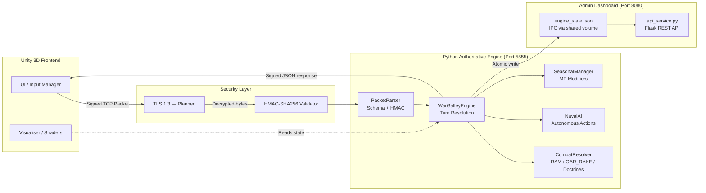
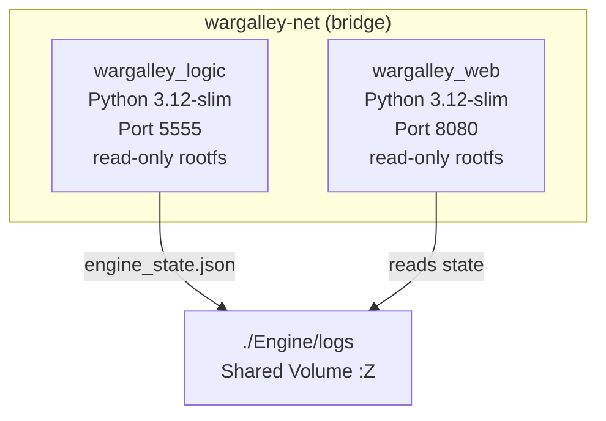

# Architecture Guide — War Galley v1.0

## Overview

The system follows an **Authoritative Server Pattern**. The Unity client is a "dumb" visualiser; all state changes (ramming, fatigue, sinking) are calculated in the Python engine container and sent back to Unity as signed JSON updates.

## System Architecture Diagram

## Component Descriptions

**PacketParser** validates every incoming packet against a JSON Schema before checking the HMAC signature. Malformed or tampered packets are dropped and logged before reaching the engine.

**WarGalleyEngine** is the single authoritative source of truth. It holds the vessel list, processes seasonal modifiers, delegates movement, and calls CombatResolver for RAM and OAR_RAKE commands. It returns a serialised vessel state list after every tick.

**CombatResolver** handles all damage calculations using `apply_damage()` on the Vessel base class. It also implements the three national doctrines: Corvus boarding (Rome), crew speed burst (Carthage), and Ballista fire (Egypt).

**NavalAI** provides autonomous actions (RETREAT or ATTACK_NEAREST) for vessels that fall outside the flagship command radius.

**SeasonalManager** applies per-season MP modifiers and storm attrition at the start of each turn.

**api_service.py** exposes a single authenticated GET endpoint (`/api/v1/telemetry`) that reads `engine_state.json`, which is written atomically by `main.py` after every tick via a shared Podman volume.

## Security Architecture

All packets are signed with HMAC-SHA256 (FIPS 140-2). The server validates signature before any game logic executes. TLS 1.3 transport encryption is planned for v1.1. The Admin API requires a Bearer token validated using `hmac.compare_digest()` to prevent timing attacks.

## Container Architecture

Both containers run with `read_only: true`, `tmpfs` mounts for `/tmp` and `/run`, CPU and memory resource limits, and a default seccomp profile (CIS Level 2).
