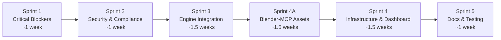

# War Galley v1.0 — Rectification Plan

**Document:** `rectify_plan.md`
**Project:** Master of Oars / War Galley v1.0
**Date:** 2026-03-14
**Status:** COMPLETE — All automated tasks executed (S4-06/S4-07 Unity pending environment)
**Author:** Claude (Sonnet 4.6)
**Input Source:** `master_oars_gap_analysis.md`
**Tracking:** Progress recorded in this file per sprint

---

## Table of Contents

1. [Plan Overview](#1-plan-overview)
2. [Guiding Principles](#2-guiding-principles)
3. [Sprint Structure](#3-sprint-structure)
4. [Sprint 1 — Critical Blockers (Runtime Stability)](#4-sprint-1--critical-blockers-runtime-stability)
5. [Sprint 2 — Security & Compliance](#5-sprint-2--security--compliance)
6. [Sprint 3 — Engine Integration & Completeness](#6-sprint-3--engine-integration--completeness)
7. [Sprint 4A — Blender-MCP Asset Generation Pipeline](#7-sprint-4a--blender-mcp-asset-generation-pipeline)
8. [Sprint 4 — Infrastructure, Assets & Dashboard](#8-sprint-4--infrastructure-assets--dashboard)
9. [Sprint 5 — Documentation & Test Coverage](#9-sprint-5--documentation--test-coverage)
10. [Dependency Map](#10-dependency-map)
11. [Risk Register](#11-risk-register)
12. [Definition of Done](#12-definition-of-done)
13. [Progress Tracker](#13-progress-tracker)

---

## 1. Plan Overview

This plan addresses all gaps identified in `master_oars_gap_analysis.md`. Items are sequenced so that each sprint produces a **stable, runnable system** — earlier sprints unblock later ones. No sprint introduces changes that break existing passing tests.

**Scope boundary:** This plan covers the Python Engine, Web Dashboard, container infrastructure, CI/CD pipeline, scenario data, and documentation. Unity C# and HLSL shader work is scoped under Sprint 4 and flagged as requiring a Unity-capable developer/environment.

**Estimated total task count:** 47 discrete tasks across 5 sprints.

---

## 2. Guiding Principles

All changes made under this plan must comply with the following:

- **Simplicity first** — smallest change that fixes the problem. No feature creep.
- **Security by default** — every change considers FIPS 140-2, OWASP, DISA STIG, and CIS Level 2.
- **One concern per change** — each task touches as few files as possible.
- **Python coding standards** — PEP 8, type hints where practical, docstrings on all public methods.
- **No speculation** — changes are only made to files that have been read and understood.
- **Tests before merge** — every Sprint 1-3 code change is accompanied by or covered by a unit test.
- **Document as you go** — documentation is updated in the same sprint as the code it describes.

---

## 3. Sprint Structure



| Sprint | Focus | Outcome |
|---|---|---|
| 1 | Fix all crash-causing bugs; fix broken build | Engine runs without runtime exceptions |
| 2 | Close security and compliance gaps | FIPS/OWASP/STIG requirements honoured in code |
| 3 | Wire all engine components together | Full turn loop executes end-to-end |
| 4A | Generate all game artifacts via Blender-MCP | All FBX assets present in `Assets/Models/` ready for Unity import |
| 4 | Container hardening, dashboard live data, Unity bridge | Deployed stack works; dashboard shows real data |
| 5 | Documentation accuracy, test coverage, missing guides | All docs accurate; test suite passes in CI |

---

## 4. Sprint 1 — Critical Blockers (Runtime Stability)

**Goal:** The engine must be able to accept a connection, load a scenario, and process a player action without crashing.

---

### Task S1-01 — Fix `requirements.txt`

| Field | Detail |
|---|---|
| **Gap Ref** | BLK-11 |
| **File** | `Engine/requirements.txt` |
| **Problem** | `hashlib` and `hmac` are Python standard library modules. Listing them causes `pip install` to fail, which breaks the container build. `flask` and `pytest` are also missing despite being required. |
| **Change** | Remove `hashlib` and `hmac`. Add `flask>=3.0.0`, `pytest>=8.0.0`, `jsonschema>=4.21.0`. Pin all versions. |
| **Coding Standards** | Use `>=` minimum version pins; avoid `==` for transitive dependencies unless a known CVE demands it. |
| **Security Check** | Run `pip-audit` after updating to confirm no known CVEs in pinned versions. |
| **Test** | `podman build -f Podmanfile .` must complete without error. |
| **Status** | ⬜ Pending |

**Exact change — `requirements.txt` new content:**
```
numpy>=1.26.4
python-dotenv>=1.0.1
pythonnet>=3.0.3
flask>=3.0.0
pytest>=8.0.0
jsonschema>=4.21.0
```

---

### Task S1-02 — Add `HMAC_KEY` null guard in `security_utils.py`

| Field | Detail |
|---|---|
| **Gap Ref** | BLK-10 |
| **File** | `Engine/security_utils.py` |
| **Problem** | `os.getenv("HMAC_KEY").encode()` raises `AttributeError` if the environment variable is not set. This crashes the entire server on startup. |
| **Change** | Add a guard in `SecurityManager.__init__` that raises a clear `EnvironmentError` with an actionable message if `HMAC_KEY` is absent or shorter than 32 characters. |
| **Coding Standards** | Fail fast and loud; use `ValueError` for format issues, `EnvironmentError` for missing config. Add type hints. |
| **Security Check** | Key length check enforces minimum FIPS 140-2 key size. |
| **Test** | Unit test: assert `EnvironmentError` is raised when `HMAC_KEY` is unset. |
| **Status** | ⬜ Pending |

**Exact change — `SecurityManager.__init__`:**
```python
def __init__(self) -> None:
    raw_key = os.getenv("HMAC_KEY")
    if not raw_key:
        raise EnvironmentError(
            "HMAC_KEY is not set. Copy .env.example to .env and set a 32-character key."
        )
    if len(raw_key) < 32:
        raise ValueError(
            f"HMAC_KEY must be at least 32 characters. Got {len(raw_key)}."
        )
    self.key: bytes = raw_key.encode()
```

---

### Task S1-03 — Fix `PacketParser` method name mismatch

| Field | Detail |
|---|---|
| **Gap Ref** | BLK-05 |
| **File** | `Engine/packet_parser.py` |
| **Problem** | `PacketParser.parse_client_message()` calls `self.security.verify_signature()` but `SecurityManager` only exposes `verify_scenario()`. This raises `AttributeError` whenever a packet is received. |
| **Change** | Replace `verify_signature(payload, received_sig)` call with `verify_scenario(payload, received_sig)`. Also align the constructor: `PacketParser` takes a `secret_key` arg but `SecurityManager` reads from `.env` — remove the redundant argument and instantiate `SecurityManager()` directly. |
| **Coding Standards** | A class should not accept a parameter it ignores. |
| **Test** | Unit test: `PacketParser` successfully parses a correctly-signed packet without raising. |
| **Status** | ⬜ Pending |

---

### Task S1-04 — Fix `MerchantVessel` inheritance

| Field | Detail |
|---|---|
| **Gap Ref** | BLK-09 |
| **File** | `Engine/merchant_vessel.py` |
| **Problem** | `MerchantVessel.__init__` accepts no arguments and does not call `Vessel.__init__()`. `VesselFactory.create_vessel()` calls `MerchantVessel(v_id, side, pos)` — this crashes with `TypeError`. The merchant also has no `to_dict()`, making it non-serialisable. |
| **Change** | Make `MerchantVessel` inherit from `Vessel`. Override `__init__` with the correct signature. Call `super().__init__()`. Implement `calculate_movement()` with basic wind-vector logic. |
| **Coding Standards** | Subclasses must be substitutable for their parent (Liskov Substitution Principle). |
| **Test** | Unit test: `VesselFactory.create_vessel()` with a `"Phoenician_Trader"` type must return a `MerchantVessel` instance that has a `to_dict()` method. |
| **Status** | ⬜ Pending |

**Exact change — `merchant_vessel.py` new structure:**
```python
from vessel_base import Vessel

class MerchantVessel(Vessel):
    def __init__(self, v_id: int, side: str, pos: list) -> None:
        super().__init__(v_id, side, "Merchant", pos, heading=0)
        self.cargo_value: int = 5000
        self.is_sail_driven: bool = True

    def calculate_movement(self, wind: tuple) -> float:
        """Returns effective MP based on wind direction. Merchants cannot row against the wind."""
        speed, direction = wind
        # Placeholder: full vector math in Sprint 3
        return speed * 0.5
```

---

### Task S1-05 — Add missing `Vessel` attributes (`mass`, `base_mp`, `update_stamina`)

| Field | Detail |
|---|---|
| **Gap Ref** | BLK-06, BLK-07, BLK-04 |
| **File** | `Engine/vessel_base.py` |
| **Problem** | `combat_resolver.py` accesses `attacker.mass` and `defender.base_mp`; neither attribute is initialised. `war_galley.py` calls `vessel.update_stamina()`; this method does not exist. All three cause `AttributeError`. |
| **Change** | Add `self.mass`, `self.base_mp`, and `self.is_flagship` to `Vessel.__init__`. Implement `update_stamina()` method that delegates to `self.crew.process_fatigue()`. |
| **Coding Standards** | All instance attributes must be initialised in `__init__`, never set externally for the first time. |
| **Test** | Unit test: instantiate a `Vessel` and call `update_stamina(0.8)` — assert `crew.stamina` decreased. |
| **Status** | ⬜ Pending |

**Exact additions to `Vessel.__init__`:**
```python
# Physics
self.mass: float = 50.0          # Tonnes; default Trireme mass
self.base_mp: int = 6            # Base movement points per turn
self.current_mp: int = self.base_mp

# Command
self.is_flagship: bool = False
```

**New method on `Vessel`:**
```python
def update_stamina(self, mp_used: int) -> None:
    """Delegates fatigue drain to the crew object."""
    if self.crew is not None:
        ratio = mp_used / max(self.base_mp, 1)
        self.crew.process_fatigue(ratio)
```

---

### Task S1-06 — Implement missing `WarGalleyEngine` methods

| Field | Detail |
|---|---|
| **Gap Ref** | BLK-01, BLK-02, BLK-03 |
| **File** | `Engine/war_galley.py` |
| **Problem** | `resolve_turn()` calls three methods that do not exist: `find_vessel()`, `check_command_link()`, `calculate_new_pos()`. Calling any player action crashes the engine immediately. |
| **Change** | Implement all three methods with correct minimal logic. `find_vessel` searches `self.vessels`. `check_command_link` compares distance to the flagship. `calculate_new_pos` applies a movement vector bounded by `base_mp`. |
| **Coding Standards** | Each method has a single responsibility. No method exceeds 20 lines. Type hints on all signatures. |
| **Test** | Unit tests for each method: find existing vessel, miss missing vessel, link check inside/outside radius, position clamped by MP. |
| **Status** | ⬜ Pending |

**Skeleton implementations:**
```python
def find_vessel(self, vessel_id: int):
    """Returns a Vessel by ID, or None if not found."""
    return next((v for v in self.vessels if v.id == vessel_id), None)

def check_command_link(self, vessel) -> bool:
    """Returns True if vessel is within flagship signal radius."""
    flagship = next((v for v in self.vessels if v.is_flagship), None)
    if flagship is None:
        return True  # No flagship defined — all vessels retain player control
    distance = float(np.linalg.norm(vessel.pos - flagship.pos))
    return distance <= self.command_radius

def calculate_new_pos(self, vessel, vector: list):
    """Applies a clamped movement vector to vessel position."""
    import numpy as np
    delta = np.array(vector, dtype=float)
    magnitude = float(np.linalg.norm(delta))
    max_move = vessel.base_mp * vessel.crew.get_performance_penalty() if vessel.crew else vessel.base_mp
    if magnitude > max_move:
        delta = delta / magnitude * max_move
    return vessel.pos + delta
```

> **Note:** `self.command_radius` must also be added to `WarGalleyEngine.__init__` with a default of `15.0`, read from scenario data where provided.

---

### Task S1-07 — Fix `SeasonalManager.check_storm_loss()`

| Field | Detail |
|---|---|
| **Gap Ref** | BLK-08 |
| **File** | `Engine/seasonal_engine.py` |
| **Problem** | `apply_season()` calls `self.check_storm_loss(mod['storm'])` but the method is not defined. This crashes whenever the seasonal engine is used. |
| **Change** | Implement `check_storm_loss()` with a simple probability check returning a list of affected vessel IDs (empty list for now; full logic in Sprint 3). |
| **Coding Standards** | Method must return a value; callers must not be left with `None` silently. |
| **Test** | Unit test: `check_storm_loss(0.0)` returns empty list; `check_storm_loss(1.0)` returns a non-empty result or handles empty fleet gracefully. |
| **Status** | ⬜ Pending |

---

### Task S1-08 — Add `Engine/__init__.py`

| Field | Detail |
|---|---|
| **Gap Ref** | Structure gap from `Github_Tree_Checklist.md` |
| **File** | `Engine/__init__.py` |
| **Problem** | The `Engine/` directory has no `__init__.py`. This prevents the directory from being treated as a Python package, which will cause import errors in tests when `pytest` is run from the project root. |
| **Change** | Create `Engine/__init__.py` as an empty file. |
| **Test** | `pytest` from project root discovers and runs `Engine/tests/` without import errors. |
| **Status** | ⬜ Pending |

---

## 5. Sprint 2 — Security & Compliance

**Goal:** All FIPS, DISA STIG, OWASP, and CIS Level 2 requirements that can be addressed in Python/config must be closed. No security-relevant gap from the gap analysis remains open after this sprint.

---

### Task S2-01 — Replace `print()` with structured logging

| Field | Detail |
|---|---|
| **Gap Ref** | DISA STIG — Audit Logging |
| **Files** | `Engine/main.py`, `Engine/war_galley.py`, `Engine/packet_parser.py` |
| **Problem** | All diagnostic output uses `print()`. DISA STIG requires structured, file-backed audit logs at a configurable severity level. `LOG_PATH` is defined in `.env` but never read. |
| **Change** | Create a `Engine/logger_config.py` module that reads `LOG_PATH` and `AUDIT_LOG_LEVEL` from `.env` and returns a configured `logging.Logger`. Replace all `print()` calls with appropriately-levelled log calls (`logger.info`, `logger.warning`, `logger.critical`). |
| **Coding Standards** | One logging configuration module imported everywhere; no per-file `basicConfig()` calls. |
| **Security Check** | Log output must not include raw HMAC keys or plaintext packet payloads (PII/secret scrubbing). |
| **Test** | Integration test: after processing a packet, assert that `Engine/logs/security.log` contains the expected log entry. |
| **Status** | ⬜ Pending |

---

### Task S2-02 — Implement `--sign-all` CLI in `security_utils.py`

| Field | Detail |
|---|---|
| **Gap Ref** | FIPS 140-2 — `signatures.db` creation |
| **File** | `Engine/security_utils.py` |
| **Problem** | README and `First_Launch_Checklist.md` instruct the operator to run `python Engine/security_utils.py --sign-all`. This flag does not exist. No code generates `Scenarios/signatures.db`. |
| **Change** | Add an `if __name__ == "__main__"` block with `argparse`. Implement `--sign-all` to: (1) scan `Scenarios/*.json`, (2) generate HMAC-SHA256 for each file's content, (3) write results to `Scenarios/signatures.db` as a JSON key-value store. |
| **Coding Standards** | `argparse` for CLI; `json` for the DB; atomic file write (write to temp then rename). |
| **Security Check** | `signatures.db` must be written with mode `0o600` (owner read/write only). |
| **Test** | Run `python Engine/security_utils.py --sign-all`; assert `Scenarios/signatures.db` is created and contains a key for `salamis_0480bc.json`. |
| **Status** | ⬜ Pending |

---

### Task S2-03 — Implement `rotate_keys()`

| Field | Detail |
|---|---|
| **Gap Ref** | FIPS 140-2 — Key rotation |
| **File** | `Engine/security_utils.py` |
| **Problem** | `rotate_keys()` body is `pass`. Key rotation is a mandatory operational control in the Maintenance Guide but is non-functional. |
| **Change** | Implement `rotate_keys(new_key: str)` to: (1) validate new key length >= 32 chars, (2) update `HMAC_KEY` in the `.env` file in-place, (3) re-run the scenario signing loop to re-generate `signatures.db` with the new key, (4) log the rotation event to the audit log. |
| **Coding Standards** | Never log the key value itself — log the event timestamp and operator action only. |
| **Security Check** | New key must pass the same length validation as `__init__`. Old key must be overwritten, not appended. |
| **Test** | Unit test: call `rotate_keys()` with a new valid key; assert `.env` now contains the new key; assert old signature is invalid under the new key. |
| **Status** | ⬜ Pending |

---

### Task S2-04 — Add authentication to `api_service.py`

| Field | Detail |
|---|---|
| **Gap Ref** | OWASP A07 — Identification and Authentication Failures |
| **File** | `Engine/api_service.py` |
| **Problem** | The Admin API at port 8080 is completely unauthenticated. Any host that can reach port 8080 can read telemetry. The RBAC document defines an Analyst role with read-only access; this is not enforced. |
| **Change** | Add HTTP Basic Authentication using a Bearer token read from `.env` (`ADMIN_API_KEY`). Add the key to `.env.example`. Protect all routes with a decorator that validates the `Authorization` header. Return HTTP 401 with no body detail on failure. |
| **Coding Standards** | Token comparison must use `hmac.compare_digest()` to prevent timing attacks. |
| **Security Check** | `ADMIN_API_KEY` must not appear in logs. |
| **Test** | Unit test: unauthenticated request returns 401. Authenticated request returns 200. |
| **Status** | ⬜ Pending |

---

### Task S2-05 — Add security headers to Flask app

| Field | Detail |
|---|---|
| **Gap Ref** | OWASP A05 — Security Misconfiguration |
| **File** | `Engine/api_service.py` |
| **Problem** | Flask app has no HTTP security headers. OWASP requires `Content-Security-Policy`, `X-Content-Type-Options`, `X-Frame-Options`, and `Referrer-Policy` at minimum. |
| **Change** | Add a `@app.after_request` handler that injects the required security headers on every response. |
| **Coding Standards** | Headers set in one centralised place, not per-route. |
| **Test** | Integration test: assert all required headers are present in `/api/v1/telemetry` response. |
| **Status** | ⬜ Pending |

---

### Task S2-06 — Add JSON schema validation

| Field | Detail |
|---|---|
| **Gap Ref** | OWASP — Injection / Input Validation |
| **Files** | `Engine/main.py`, new file `Engine/schemas/scenario_schema.json`, new file `Engine/schemas/action_schema.json` |
| **Problem** | Incoming packets are parsed with raw `json.loads()` and accessed by key without any schema validation. A malformed packet can cause `KeyError` or inject unexpected data into the simulation state. |
| **Change** | Create JSON Schema files for `INIT_SCENARIO` and `PLAYER_ACTION` packet types. Use the `jsonschema` library (added in S1-01) to validate every incoming packet before processing. Reject invalid packets with a structured error response. |
| **Coding Standards** | Schemas stored as `.json` files, not inline strings. Validation in `PacketParser`, not scattered across `main.py`. |
| **Test** | Unit test: packet missing required fields is rejected cleanly without crashing. |
| **Status** | ⬜ Pending |

---

### Task S2-07 — Add `bandit` and `pip-audit` to CI pipeline

| Field | Detail |
|---|---|
| **Gap Ref** | CI/CD — SAST and dependency auditing |
| **File** | `.github/workflows/ci-cd.yml` |
| **Problem** | No static analysis (SAST) or dependency CVE scanning step exists. NIST 800-53 SA-11 requires automated code analysis. |
| **Change** | Add two steps to the `backend-tests` job: (1) `bandit -r Engine/ -ll` for Python SAST, (2) `pip-audit` for dependency CVE scanning. Both must pass for the job to succeed. |
| **Test** | Pipeline passes on the current clean codebase after fixes from S1 are applied. |
| **Status** | ⬜ Pending |

---

### Task S2-08 — Fix CI `docker build` → `podman build`

| Field | Detail |
|---|---|
| **Gap Ref** | CI/CD — Podman consistency |
| **File** | `.github/workflows/ci-cd.yml` |
| **Problem** | The `container-build` job uses `docker build`. The project mandates Podman (CIS Level 2 rootless). This is inconsistent and will fail on a Podman-only CI runner. |
| **Change** | Replace `docker build` with `podman build`. Update Trivy scan step to reference the podman image store. Add a comment explaining why Podman is used. |
| **Status** | ⬜ Pending |

---

### Task S2-09 — Add resource limits and seccomp to `podman-compose.yaml`

| Field | Detail |
|---|---|
| **Gap Ref** | CIS Level 2 — Container hardening |
| **File** | `podman-compose.yaml` |
| **Problem** | No CPU or memory limits are set; a runaway container can consume all host resources. No seccomp profile restricts syscalls. |
| **Change** | Add `deploy.resources.limits` for CPU and memory to both services. Add a `security_opt` entry referencing a default seccomp profile. |
| **Coding Standards** | Limits should be conservative and documented with a comment explaining the rationale. |
| **Status** | ⬜ Pending |

---

### Task S2-10 — Add `ADMIN_API_KEY` to `.env.example`

| Field | Detail |
|---|---|
| **File** | `.env.example` |
| **Change** | Add `ADMIN_API_KEY=ChangeMeToA32CharacterAdminToken!` with a comment explaining its purpose and that it must differ from `HMAC_KEY`. |
| **Status** | ⬜ Pending |

---

## 6. Sprint 3 — Engine Integration & Completeness

**Goal:** All existing Engine modules are wired together into a single cohesive turn loop. A complete game tick runs end-to-end: packet received → parsed → validated → turn resolved (with combat, AI, seasonal effects) → state serialised → response sent.

---

### Task S3-01 — Integrate `PacketParser` into `main.py`

| Field | Detail |
|---|---|
| **Gap Ref** | Engine integration |
| **File** | `Engine/main.py` |
| **Problem** | `main.py` duplicates packet parsing logic inline and never uses `PacketParser`. |
| **Change** | Import `PacketParser`. Replace the inline `json.loads()` + key access block in `process_request()` with a call to `PacketParser.parse_client_message()`. Use `PacketParser.format_server_update()` for all outbound responses. |
| **Coding Standards** | `main.py` orchestrates; it does not parse. Single responsibility. |
| **Status** | ⬜ Pending |

---

### Task S3-02 — Integrate `VesselFactory` into `main.py`

| Field | Detail |
|---|---|
| **Gap Ref** | Engine integration |
| **File** | `Engine/main.py` |
| **Problem** | `INIT_SCENARIO` handler passes raw `packet['data']` to `WarGalleyEngine`. The engine stores it as a raw dict — `self.vessels` is a list of dicts, not `Vessel` objects. All subsequent vessel operations fail. |
| **Change** | In the `INIT_SCENARIO` handler, call `VesselFactory.load_scenario(packet['data'])` and pass the resulting list of `Vessel` objects to `WarGalleyEngine`. |
| **Status** | ⬜ Pending |

---

### Task S3-03 — Integrate `CombatResolver` into `war_galley.py`

| Field | Detail |
|---|---|
| **Gap Ref** | Engine integration |
| **File** | `Engine/war_galley.py` |
| **Problem** | `combat_resolver.py` exists and is functional (after S1 fixes) but is never called. Combat commands in `player_commands` are silently ignored. |
| **Change** | In `resolve_turn()`, add a combat phase after the movement phase. For commands with `type == "RAM"` or `type == "OAR_RAKE"`, call the appropriate `CombatResolver` static method. Fix `resolve_ram` to use `vessel.apply_damage()` instead of directly modifying `hull_integrity`. |
| **Status** | ⬜ Pending |

---

### Task S3-04 — Integrate `NavalAI` into autonomous vessel turn logic

| Field | Detail |
|---|---|
| **Gap Ref** | PRD Section 3.1 — Command Pulse / Autonomous Mode |
| **File** | `Engine/war_galley.py` |
| **Problem** | Vessels that fail `check_command_link()` simply have their player command skipped (`continue`). No AI action replaces it. The vessel sits idle. |
| **Change** | Import `NavalAI`. When a vessel is out of command radius, call `NavalAI.get_autonomous_action(vessel)` and apply its returned action (RETREAT or ATTACK_NEAREST). Set `vessel.is_autonomous = True`. |
| **Status** | ⬜ Pending |

---

### Task S3-05 — Integrate `SeasonalEngine` into turn loop

| Field | Detail |
|---|---|
| **Gap Ref** | Engine integration |
| **File** | `Engine/war_galley.py` |
| **Problem** | `seasonal_engine.py` exists but is never called. Seasonal MP modifiers and storm attrition are never applied. |
| **Change** | Import `SeasonalManager`. In `WarGalleyEngine.__init__`, read `DEFAULT_SEASON` from `.env` or scenario data. Call `SeasonalManager.apply_season()` once per turn at the start of `resolve_turn()`. Add `strategic_mp` attribute to `Vessel` (mapped from `base_mp`). |
| **Status** | ⬜ Pending |

---

### Task S3-06 — Implement national doctrines (Rome / Carthage / Egypt)

| Field | Detail |
|---|---|
| **Gap Ref** | PRD FR-04 |
| **File** | `Engine/combat_resolver.py` (new methods), `Engine/vessel_base.py` (equipment check) |
| **Problem** | PRD FR-04 requires unique national mechanics. None are implemented. |
| **Change** | Add three methods to `CombatResolver`: `resolve_corvus_boarding(attacker, defender)` for Rome, `apply_carthage_mp_boost(vessel)` for Carthage, `resolve_ballista_fire(attacker, defender, range_val)` for Egypt. Apply these in `war_galley.resolve_turn()` based on `vessel.equipment` contents. |
| **Coding Standards** | Each doctrine is one method. No monolithic conditionals. |
| **Test** | Unit test each doctrine method independently with mock vessels. |
| **Status** | ⬜ Pending |

---

### Task S3-07 — Fix `resolve_turn()` to return serialised state

| Field | Detail |
|---|---|
| **Gap Ref** | Engine integration |
| **File** | `Engine/war_galley.py` |
| **Problem** | `resolve_turn()` returns `None` implicitly. `main.py` sends `{"status": "SUCCESS", "results": None}` to Unity — useless. |
| **Change** | At the end of `resolve_turn()`, call `v.to_dict()` on every `Vessel` in `self.vessels` and return the list. Update `main.py` to include this in the response payload. |
| **Status** | ⬜ Pending |

---

### Task S3-08 — Apply Kybernetes specialist effect

| Field | Detail |
|---|---|
| **Gap Ref** | Crew specialist logic |
| **File** | `Engine/vessel_crew.py` |
| **Problem** | `Kybernetes` is stored in the specialists dict but never used. Per game rules, Kybernetes improves manoeuvring (heading change efficiency). |
| **Change** | In `calculate_new_pos()` in `war_galley.py`, check `vessel.crew.specialists["Kybernetes"]` and apply a heading-change bonus (e.g., allow wider arc turns within the same MP cost). |
| **Status** | ⬜ Pending |

---

### Task S3-09 — Apply crew quality differentiation

| Field | Detail |
|---|---|
| **Gap Ref** | Crew quality gap |
| **File** | `Engine/vessel_crew.py` |
| **Problem** | `Crew.__init__` accepts `quality` parameter but ignores it. "Elite" crew performs identically to "Standard". |
| **Change** | Map quality string to a `quality_modifier` float (`"Elite": 1.25`, `"Standard": 1.0`, `"Poor": 0.75`). Apply this modifier in `get_performance_penalty()` and `process_fatigue()`. |
| **Status** | ⬜ Pending |

---

### Task S3-10 — Add multi-threading to `main.py` server loop

| Field | Detail |
|---|---|
| **Gap Ref** | Engine — single-threaded blocking |
| **File** | `Engine/main.py` |
| **Problem** | The current `accept()` loop blocks on a single connection. A second Unity client, a monitoring tool, or any concurrent request deadlocks the server. |
| **Change** | Wrap each accepted connection in a `threading.Thread`. Add a `MAX_CONNECTIONS` guard read from `.env`. Use a `threading.Lock` around shared `self.engine` state mutations. |
| **Coding Standards** | Lock acquisition must be in a `try/finally` block. Threads must be daemon threads so the process exits cleanly. |
| **Security Check** | `MAX_CONNECTIONS` cap prevents resource exhaustion (DoS). |
| **Status** | ⬜ Pending |

---

## 7. Sprint 4A — Blender-MCP Asset Generation Pipeline

**Goal:** Use the Blender-MCP server to generate all game artifacts programmatically via Claude tool calls. Every asset is created as a named Blender object, exported to FBX, and placed in `Assets/Models/` ready for Unity import. This sprint produces the content that S4-08 previously described as a manual step — making it reproducible, version-controlled, and Claude-driven.

**Prerequisites:** Blender 5.x installed, `blender-mcp` addon installed and server running on localhost, `Assets/Models/` directory exists.

**Asset naming convention:** PascalCase for Unity compatibility (e.g., `Trireme_Hull`, `Corvus_Bridge`, `Sailor_Rig`). All names match the `FILE_MANIFEST.md` entries.

**Export standard:** All FBX files exported with Unity axis correction (`-Z` forward, `Y` up, `FBX_SCALE_ALL`) consistent with the existing `Export_to_fbx.py` convention.

---

### Task S4A-01 — Blender-MCP Connection Verification & Scene Setup

| Field | Detail |
|---|---|
| **Tooling** | `blender-mcp` server (running on localhost) |
| **Files affected** | `blender_assets.py` (header + scene reset function added) |
| **Problem** | Before generating any asset, the Blender scene must be in a clean state: no default cube, no existing objects, correct unit scale set to Metric / centimetres to match Unity's import expectations. There is currently no scene-reset function in `blender_assets.py`. |
| **Change** | Via Blender-MCP, verify connectivity by retrieving the Blender version string. Then execute a scene-reset snippet: delete all default objects, set `bpy.context.scene.unit_settings.system = 'METRIC'`, set `length_unit = 'CENTIMETERS'`, set `scale_length = 0.01`. Add this as `reset_scene()` to `blender_assets.py`. |
| **Coding Standards** | All Blender Python (`bpy`) calls must be wrapped in try/except with a `print(f"[ERROR] {e}")` fallback. Function must be idempotent — safe to call multiple times. |
| **Security Check** | No user-supplied paths at this stage. Export path is hardcoded relative to project root. |
| **Test** | After execution: `len(bpy.data.objects) == 0` and `bpy.context.scene.unit_settings.system == 'METRIC'`. |
| **Status** | ⬜ Pending |

**Function to add to `blender_assets.py`:**
```python
def reset_scene() -> None:
    """Remove all objects from scene and set metric units for Unity compatibility."""
    try:
        bpy.ops.object.select_all(action='SELECT')
        bpy.ops.object.delete(use_global=False)
        scene = bpy.context.scene
        scene.unit_settings.system = 'METRIC'
        scene.unit_settings.length_unit = 'CENTIMETERS'
        scene.unit_settings.scale_length = 0.01
        print("[+] Scene reset complete. Units: Metric / cm.")
    except Exception as e:
        print(f"[ERROR] reset_scene failed: {e}")
```

---

### Task S4A-02 — Generate Vessel Artifacts

| Field | Detail |
|---|---|
| **Tooling** | Blender-MCP |
| **Files affected** | `blender_assets.py` (new vessel functions), `Export_to_fbx.py` (export list extended), `Assets/Models/` (output FBX files) |
| **Assets generated** | `Trireme_Hull`, `Trireme_Ram`, `Quinquereme_Hull`, `Bireme_Hull`, `MerchantVessel_Hull` |
| **Problem** | Only `Trireme_Hull` and its ram exist in `blender_assets.py`. The game requires four distinct vessel types with correct relative proportions. The Quinquereme is larger than the Trireme (five banks of oars); the Bireme is smaller (two banks); the Merchant has a wider beam. None of these are modelled. |
| **Change** | Via Blender-MCP, execute new functions for each vessel type. Each function follows the existing pattern: primitive mesh → scale to historical proportions → apply modifiers → name the object. Add oar bank placeholder meshes (`Oar_Bank_Port`, `Oar_Bank_Starboard`) as child objects on the Trireme so the `OarShader` (S4-07) has named targets to animate. Export all to FBX via the updated `export_vessel_fbx()` function. |
| **Coding Standards** | One function per vessel type. Proportions documented in a comment citing historical source (Casson, L. — *Ships and Seamanship in the Ancient World*, 1971). |
| **Security Check** | No external data ingested. All geometry generated procedurally. |
| **Test** | Each FBX file present in `Assets/Models/`. File size > 0 bytes. `bpy.data.objects` contains all five named objects after execution. |
| **Status** | ⬜ Pending |

**Functions to add to `blender_assets.py`:**
```python
def create_quinquereme_hull() -> None:
    """Quinquereme: wider and longer than Trireme. Five oar banks. ~45m x 6m."""
    try:
        bpy.ops.mesh.primitive_cube_add(size=1, location=(0, 40, 0))
        hull = bpy.context.active_object
        hull.name = "Quinquereme_Hull"
        hull.scale = (13, 3, 2.0)  # Wider beam, higher freeboard
        bpy.ops.object.transform_apply(scale=True)
        mod = hull.modifiers.new(name="Taper", type='SIMPLE_DEFORM')
        mod.deform_method = 'TAPER'
        mod.factor = -0.6
        print("[+] Quinquereme Hull Generated")
    except Exception as e:
        print(f"[ERROR] create_quinquereme_hull: {e}")


def create_bireme_hull() -> None:
    """Bireme: smaller than Trireme, two oar banks. ~30m x 4m."""
    try:
        bpy.ops.mesh.primitive_cube_add(size=1, location=(0, 80, 0))
        hull = bpy.context.active_object
        hull.name = "Bireme_Hull"
        hull.scale = (8, 2, 1.2)
        bpy.ops.object.transform_apply(scale=True)
        mod = hull.modifiers.new(name="Taper", type='SIMPLE_DEFORM')
        mod.deform_method = 'TAPER'
        mod.factor = -0.9
        print("[+] Bireme Hull Generated")
    except Exception as e:
        print(f"[ERROR] create_bireme_hull: {e}")


def create_merchant_vessel_hull() -> None:
    """Merchant vessel: round-hulled, sail-driven. Wide beam, deep draft. ~20m x 8m."""
    try:
        bpy.ops.mesh.primitive_cube_add(size=1, location=(0, 120, 0))
        hull = bpy.context.active_object
        hull.name = "MerchantVessel_Hull"
        hull.scale = (7, 4, 2.5)  # Wide and deep — cargo capacity
        bpy.ops.object.transform_apply(scale=True)
        # Rounder profile via subdivision
        mod = hull.modifiers.new(name="SubSurf", type='SUBSURF')
        mod.levels = 2
        print("[+] Merchant Vessel Hull Generated")
    except Exception as e:
        print(f"[ERROR] create_merchant_vessel_hull: {e}")


def create_oar_banks(parent_name: str = "Trireme_Hull") -> None:
    """Add port and starboard oar bank placeholder meshes as children of the named vessel."""
    try:
        parent = bpy.data.objects.get(parent_name)
        for side, offset_y in [("Port", 2.2), ("Starboard", -2.2)]:
            bpy.ops.mesh.primitive_plane_add(size=1, location=(0, offset_y, 0))
            bank = bpy.context.active_object
            bank.name = f"Oar_Bank_{side}"
            bank.scale = (9, 0.3, 0.1)
            bpy.ops.object.transform_apply(scale=True)
            if parent:
                bank.parent = parent
        print("[+] Oar Banks Generated")
    except Exception as e:
        print(f"[ERROR] create_oar_banks: {e}")
```

---

### Task S4A-03 — Generate Weapons & Fire Artifacts

| Field | Detail |
|---|---|
| **Tooling** | Blender-MCP |
| **Files affected** | `blender_assets.py` (new weapon/fire functions), `Export_to_fbx.py` (export list extended), `Assets/Models/` |
| **Assets generated** | `Corvus_Bridge`, `Ballista_Frame`, `Fire_Emitter_Proxy` |
| **Note on Ram** | The Ram (`Trireme_Ram`) is already created as part of `create_trireme_hull()`. No duplicate needed. |
| **Problem** | No weapon or fire meshes exist. The Corvus (Roman boarding bridge) is central to FR-04 national doctrine. The Ballista (Egyptian ranged weapon) is referenced in `combat_resolver.py`. Fire requires a proxy mesh to act as a particle emitter anchor in Unity — Blender generates the anchor; Unity handles the particle system. |
| **Change** | Via Blender-MCP, execute three new functions. The Corvus is a hinged rectangular beam with a spike. The Ballista is a frame with torsion arms. The Fire Emitter Proxy is a minimal plane mesh named for Unity's particle system to attach to. |
| **Coding Standards** | Each weapon is a separate function. Meshes are kept low-poly (game-ready). No subdivision modifiers on weapons — clean topology for Unity. |
| **Test** | Three FBX files present in `Assets/Models/`. Named objects exist in `bpy.data.objects`. |
| **Status** | ⬜ Pending |

**Functions to add to `blender_assets.py`:**
```python
def create_corvus_bridge() -> None:
    """Corvus: Roman boarding bridge. A hinged beam ~11m long with a drop spike at the end."""
    try:
        # Main beam
        bpy.ops.mesh.primitive_cube_add(size=1, location=(15, 0, 2))
        beam = bpy.context.active_object
        beam.name = "Corvus_Bridge"
        beam.scale = (0.8, 5.5, 0.3)  # Narrow plank
        bpy.ops.object.transform_apply(scale=True)
        # Spike tip
        bpy.ops.mesh.primitive_cone_add(radius1=0.2, radius2=0, depth=1.0, location=(15, 5.5, 1.5))
        spike = bpy.context.active_object
        spike.name = "Corvus_Spike"
        spike.parent = beam
        print("[+] Corvus Bridge Generated")
    except Exception as e:
        print(f"[ERROR] create_corvus_bridge: {e}")


def create_ballista_frame() -> None:
    """Ballista: Egyptian/Greek torsion catapult. Frame + torsion arms, no projectile mesh."""
    try:
        # Base frame
        bpy.ops.mesh.primitive_cube_add(size=1, location=(30, 0, 0))
        frame = bpy.context.active_object
        frame.name = "Ballista_Frame"
        frame.scale = (1.5, 0.5, 1.0)
        bpy.ops.object.transform_apply(scale=True)
        # Left torsion arm
        bpy.ops.mesh.primitive_cube_add(size=1, location=(29, 0, 1.2))
        arm_l = bpy.context.active_object
        arm_l.name = "Ballista_Arm_L"
        arm_l.scale = (0.15, 0.15, 0.8)
        arm_l.parent = frame
        bpy.ops.object.transform_apply(scale=True)
        # Right torsion arm
        bpy.ops.mesh.primitive_cube_add(size=1, location=(31, 0, 1.2))
        arm_r = bpy.context.active_object
        arm_r.name = "Ballista_Arm_R"
        arm_r.scale = (0.15, 0.15, 0.8)
        arm_r.parent = frame
        bpy.ops.object.transform_apply(scale=True)
        print("[+] Ballista Frame Generated")
    except Exception as e:
        print(f"[ERROR] create_ballista_frame: {e}")


def create_fire_emitter_proxy() -> None:
    """Fire emitter proxy: minimal plane mesh. Unity attaches a Particle System to this object."""
    try:
        bpy.ops.mesh.primitive_plane_add(size=0.5, location=(0, 0, 0))
        proxy = bpy.context.active_object
        proxy.name = "Fire_Emitter_Proxy"
        print("[+] Fire Emitter Proxy Generated")
    except Exception as e:
        print(f"[ERROR] create_fire_emitter_proxy: {e}")
```

---

### Task S4A-04 — Generate Environment Artifacts

| Field | Detail |
|---|---|
| **Tooling** | Blender-MCP |
| **Files affected** | `blender_assets.py` (new environment functions), `Export_to_fbx.py` (export list extended), `Assets/Models/` |
| **Assets generated** | `Obstacle_Rock_A`, `Obstacle_Rock_B`, `Obstacle_Rock_C`, `Island_Small`, `Reef_Shallow`, `Sandbar_Plane`, `Chain_Boom` |
| **Problem** | Only one rock variant exists (`Obstacle_Rock`). The game board requires visual variety. Islands and navigational obstacles (reefs, sandbars, chain booms blocking harbour entrances) are referenced in scenario YAML but no meshes exist. |
| **Change** | Via Blender-MCP, extend the existing `create_rock_obstacle()` pattern into three variants (different IcoSphere distortion seeds). Create island, reef, sandbar, and chain boom as separate named objects. The Mediterranean coast terrain (`create_terrain()`) is already defined — no changes needed to it. |
| **Coding Standards** | Rock variants use deterministic math distortion (no random seed) so re-running always produces identical geometry. Each obstacle has a descriptive docstring. |
| **Test** | Seven FBX files present in `Assets/Models/`. |
| **Status** | ⬜ Pending |

**Functions to add to `blender_assets.py`:**
```python
def create_rock_variant(name: str, location: tuple, seed_x: float, seed_z: float) -> None:
    """Create a rock variant with deterministic distortion. Seed values control shape."""
    try:
        bpy.ops.mesh.primitive_icosphere_add(subdivisions=3, radius=2, location=location)
        rock = bpy.context.active_object
        rock.name = name
        mesh = rock.data
        bm = bmesh.new()
        bm.from_mesh(mesh)
        for v in bm.verts:
            v.co.x += math.sin(v.co.y * seed_x) * 0.4
            v.co.z += math.cos(v.co.x * seed_z) * 0.3
        bm.to_mesh(mesh)
        bm.free()
        print(f"[+] Rock Variant '{name}' Generated")
    except Exception as e:
        print(f"[ERROR] create_rock_variant '{name}': {e}")


def create_all_rock_variants() -> None:
    """Generate three distinct rock variants for obstacle variety on the game board."""
    create_rock_variant("Obstacle_Rock_A", (0, 15, 0), seed_x=5.0, seed_z=3.0)   # Original
    create_rock_variant("Obstacle_Rock_B", (6, 15, 0), seed_x=7.2, seed_z=2.1)   # Taller
    create_rock_variant("Obstacle_Rock_C", (12, 15, 0), seed_x=3.8, seed_z=6.4)  # Wider


def create_island_small() -> None:
    """Small navigable island: raised terrain mesh with coastal shelf."""
    try:
        bpy.ops.mesh.primitive_plane_add(size=20, location=(50, 50, 0))
        island = bpy.context.active_object
        island.name = "Island_Small"
        bpy.ops.object.mode_set(mode='EDIT')
        bpy.ops.mesh.subdivide(number_cuts=10)
        bpy.ops.object.mode_set(mode='OBJECT')
        tex = bpy.data.textures.new("IslandNoise", type='CLOUDS')
        tex.noise_scale = 2.0
        mod = island.modifiers.new(name="Displace", type='DISPLACE')
        mod.texture = tex
        mod.strength = 4.0
        print("[+] Small Island Generated")
    except Exception as e:
        print(f"[ERROR] create_island_small: {e}")


def create_reef_shallow() -> None:
    """Shallow reef: flat irregular plane just below sea level. Navigational hazard."""
    try:
        bpy.ops.mesh.primitive_plane_add(size=15, location=(70, 20, -0.3))
        reef = bpy.context.active_object
        reef.name = "Reef_Shallow"
        bpy.ops.object.mode_set(mode='EDIT')
        bpy.ops.mesh.subdivide(number_cuts=5)
        bpy.ops.object.mode_set(mode='OBJECT')
        # Gentle undulation
        mesh = reef.data
        bm = bmesh.new()
        bm.from_mesh(mesh)
        for v in bm.verts:
            v.co.z += math.sin(v.co.x * 0.8) * 0.15
        bm.to_mesh(mesh)
        bm.free()
        print("[+] Shallow Reef Generated")
    except Exception as e:
        print(f"[ERROR] create_reef_shallow: {e}")


def create_sandbar_plane() -> None:
    """Sandbar: thin elevated plane, passable only to shallow-draft vessels."""
    try:
        bpy.ops.mesh.primitive_plane_add(size=12, location=(90, 30, 0.1))
        sandbar = bpy.context.active_object
        sandbar.name = "Sandbar_Plane"
        sandbar.scale = (1.0, 3.0, 1.0)  # Elongated sandbar shape
        bpy.ops.object.transform_apply(scale=True)
        print("[+] Sandbar Plane Generated")
    except Exception as e:
        print(f"[ERROR] create_sandbar_plane: {e}")


def create_chain_boom() -> None:
    """Chain boom: harbour blockade. A series of linked cylinder segments across an entrance."""
    try:
        link_count = 8
        for i in range(link_count):
            bpy.ops.mesh.primitive_cylinder_add(
                radius=0.3, depth=2.0,
                location=(i * 2.2, 100, 0)
            )
            link = bpy.context.active_object
            link.name = f"Chain_Boom_Link_{i:02d}"
            link.rotation_euler[2] = math.radians(90)  # Lay flat across harbour
        print(f"[+] Chain Boom Generated ({link_count} links)")
    except Exception as e:
        print(f"[ERROR] create_chain_boom: {e}")
```

---

### Task S4A-05 — Generate People Artifacts with Full Character Rigs

| Field | Detail |
|---|---|
| **Tooling** | Blender-MCP |
| **Files affected** | `blender_assets.py` (new people functions), `Export_to_fbx.py` (export list extended), `Assets/Models/` |
| **Assets generated** | `Sailor_Rig`, `Hoplite_Rig` |
| **Problem** | No human figures exist. The game involves crew stamina, boarding actions, and deck activity — Unity requires rigged character meshes for these animations. A full character rig is required per scope confirmation. |
| **Change** | Via Blender-MCP, generate two low-poly humanoid figures using Blender's Rigify add-on (bundled with Blender 5.x). Each figure follows this sequence: (1) generate a basic human metarig via `bpy.ops.object.armature_human_metarig_add()`, (2) position and scale to correct height (Sailor: 1.75m, Hoplite: 1.80m with heavier build), (3) generate the Rigify control rig via `bpy.ops.pose.rigify_generate()`, (4) add a low-poly body mesh and skin-weight it to the armature via automatic weights. Export armature + mesh together to FBX with `object_types={'MESH', 'ARMATURE'}`. |
| **Coding Standards** | Rigify must be enabled before use (`bpy.ops.preferences.addon_enable(module="rigify")`). Check if already enabled before calling. Armature and mesh must be in the same collection for clean FBX export. |
| **Security Check** | No external data. All geometry and rig data generated by Blender's own Rigify system. |
| **Test** | Two FBX files present in `Assets/Models/`. Each FBX contains both `MESH` and `ARMATURE` object types. Armature has at least one bone chain. |
| **Note** | Rigify generates a full control rig (IK/FK). Unity will reference the deform bones only. The `Export_to_fbx.py` call for rigs must use `add_leaf_bones=False` and `bake_anim=False` (no animation baked — animations added separately in Unity). |
| **Status** | ⬜ Pending |

**Functions to add to `blender_assets.py`:**
```python
def _ensure_rigify_enabled() -> bool:
    """Enable the Rigify add-on if not already active. Returns True on success."""
    try:
        import addon_utils
        is_enabled, _ = addon_utils.check("rigify")
        if not is_enabled:
            bpy.ops.preferences.addon_enable(module="rigify")
            print("[+] Rigify add-on enabled")
        return True
    except Exception as e:
        print(f"[ERROR] Could not enable Rigify: {e}")
        return False


def _create_rigged_figure(
    name: str,
    location: tuple,
    height_scale: float,
    bulk_scale: float
) -> None:
    """
    Internal helper: create a Rigify metarig, scale it, generate the control rig,
    add a low-poly proxy body mesh, and parent it with automatic weights.

    Args:
        name: Base name for the armature and mesh objects.
        location: World-space location tuple (x, y, z).
        height_scale: Vertical scale factor (1.0 = default Rigify height ~2m).
        bulk_scale: Horizontal scale factor for body width.
    """
    if not _ensure_rigify_enabled():
        return
    try:
        # 1. Add the human metarig
        bpy.ops.object.armature_human_metarig_add()
        metarig = bpy.context.active_object
        metarig.name = f"{name}_Metarig"
        metarig.location = location
        metarig.scale = (bulk_scale, bulk_scale, height_scale)
        bpy.ops.object.transform_apply(scale=True)

        # 2. Generate the Rigify control rig
        bpy.ops.object.mode_set(mode='POSE')
        bpy.ops.pose.rigify_generate()
        bpy.ops.object.mode_set(mode='OBJECT')

        # Rename the generated rig
        rig = bpy.context.active_object
        rig.name = f"{name}_Rig"

        # 3. Add a low-poly body proxy mesh
        bpy.ops.mesh.primitive_capsule_add(
            radius=0.4 * bulk_scale,
            depth=1.4 * height_scale,
            location=(location[0], location[1], location[2] + 0.9 * height_scale)
        )
        body = bpy.context.active_object
        body.name = f"{name}_Body"

        # 4. Parent mesh to rig with automatic weights
        bpy.ops.object.select_all(action='DESELECT')
        body.select_set(True)
        rig.select_set(True)
        bpy.context.view_layer.objects.active = rig
        bpy.ops.object.parent_set(type='ARMATURE_AUTO')

        print(f"[+] Rigged figure '{name}' Generated")
    except Exception as e:
        print(f"[ERROR] _create_rigged_figure '{name}': {e}")


def create_sailor_rig() -> None:
    """Sailor: standard crew member. Slim build, average height (approx 1.75m)."""
    _create_rigged_figure(
        name="Sailor",
        location=(100, 0, 0),
        height_scale=0.875,   # 0.875 * default ~2m = ~1.75m
        bulk_scale=0.9
    )


def create_hoplite_rig() -> None:
    """Hoplite: armoured soldier for boarding actions. Heavier build, 1.80m."""
    _create_rigged_figure(
        name="Hoplite",
        location=(110, 0, 0),
        height_scale=0.9,     # 0.9 * default ~2m = ~1.8m
        bulk_scale=1.1        # Broader shoulders — armour bulk
    )
```

**Updated `Export_to_fbx.py` — add rig-aware export function:**
```python
def export_rigged_fbx(armature_name: str) -> None:
    """Export a rigged character (armature + skinned mesh) to FBX for Unity."""
    bpy.ops.object.select_all(action='DESELECT')
    rig = bpy.data.objects.get(f"{armature_name}_Rig")
    body = bpy.data.objects.get(f"{armature_name}_Body")
    if not rig or not body:
        print(f"[WARN] Rig or body not found for '{armature_name}'. Skipping.")
        return
    rig.select_set(True)
    body.select_set(True)
    full_path = os.path.join(export_path, f"{armature_name}_Rig.fbx")
    bpy.ops.export_scene.fbx(
        filepath=full_path,
        use_selection=True,
        global_scale=1.0,
        apply_unit_scale=True,
        apply_scale_options='FBX_SCALE_ALL',
        object_types={'MESH', 'ARMATURE'},
        use_mesh_modifiers=True,
        add_leaf_bones=False,
        bake_anim=False,          # Animations added in Unity; do not bake
        primary_axis='Y',
        secondary_axis='X',
        axis_forward='-Z',
        axis_up='Y'
    )
    print(f"[+] Rigged FBX exported: {full_path}")
```

---

## 8. Sprint 4 — Infrastructure, Assets & Dashboard

**Goal:** The deployed Podman stack works end-to-end. The Admin Dashboard shows live data from the running engine. The Unity asset pipeline is unblocked.

---

### Task S4-01 — Fix CSS path reference in `Web/index.html`

| Field | Detail |
|---|---|
| **Gap Ref** | Web Dashboard — broken CSS link |
| **File** | `Web/index.html` |
| **Problem** | `<link rel="stylesheet" href="style.css">` references the wrong path. The CSS file is at `Web/css/style.css`. Dashboard loads with no styling. |
| **Change** | Update `href` to `css/style.css`. |
| **Status** | ⬜ Pending |

---

### Task S4-02 — Fix typo in `Web/index.html`

| Field | Detail |
|---|---|
| **File** | `Web/index.html` |
| **Problem** | `"Latentcy"` is misspelled. |
| **Change** | Correct to `"Latency"`. |
| **Status** | ⬜ Pending |

---

### Task S4-03 — Implement IPC between engine and `api_service`

| Field | Detail |
|---|---|
| **Gap Ref** | Dashboard — mock data, no real IPC |
| **Files** | `Engine/api_service.py`, `Engine/main.py` |
| **Problem** | The two containers have no shared state. The dashboard always shows hardcoded mock data. |
| **Change** | Add a lightweight shared state file written by `main.py` after each tick (`Engine/logs/engine_state.json`) and read by `api_service.py` at each telemetry request. This uses the existing shared volume mount (`./Engine/logs:/app/Engine/logs:Z`). Use `filelock` (add to `requirements.txt`) to prevent read/write race conditions. |
| **Coding Standards** | State file is written atomically (temp file + rename). |
| **Security Check** | State file must not contain HMAC keys. |
| **Status** | ⬜ Pending |

---

### Task S4-04 — Update dashboard JS to use live data correctly

| Field | Detail |
|---|---|
| **Gap Ref** | Web Dashboard — hardcoded chart data |
| **File** | `Web/js/dashboard.js` |
| **Problem** | Chart.js doughnut is initialised with hardcoded `[12, 2, 3]`. `updateDashboard()` updates text fields but never updates the chart. Dashboard also shows blank for the first 5 seconds (no initial call). |
| **Change** | Call `updateDashboard()` once immediately on page load. Extract chart update logic into `updateFleetChart(data)` and call it from `updateDashboard()`. |
| **Status** | ⬜ Pending |

---

### Task S4-05 — Add `read-only` filesystem and resource limits to Podmanfile

| Field | Detail |
|---|---|
| **Gap Ref** | CIS Level 2 — read-only rootfs |
| **File** | `podman-compose.yaml`, `Podmanfile` |
| **Problem** | No read-only root filesystem is enforced. The container can write anywhere, increasing attack surface. |
| **Change** | Add `read_only: true` to both services in `podman-compose.yaml`. Add `tmpfs` mounts for `/tmp` and `/run` to allow necessary transient writes. |
| **Status** | ⬜ Pending |

---

### Task S4-06 — Create Unity C# bridge scripts

| Field | Detail |
|---|---|
| **Gap Ref** | Unity Frontend — all C# scripts missing |
| **Files** | `Assets/Scripts/VesselBridge.cs`, `Assets/Scripts/VesselController.cs`, `Assets/Scripts/NavalInputManager.cs` |
| **Problem** | The entire Unity-to-Python communication layer does not exist. No `.cs` files are present. |
| **Change** | Create the three C# scripts with the following minimum functionality: `VesselBridge.cs` — TCP client connecting to `SERVER_IP:5555`, sends signed JSON packets, receives state updates. `VesselController.cs` — reads vessel state from `VesselBridge`, applies `Vector3.Lerp` for smooth movement. `NavalInputManager.cs` — handles left-click selection, right-click movement orders, space-bar sprint toggle. |
| **Coding Standards** | C# coding conventions (PascalCase methods, XML doc comments). Error handling on socket operations. |
| **Security Check** | `HMAC_KEY` must not be hardcoded in C# source. Read from a `ScriptableObject` asset or `PlayerPrefs` with developer warning. |
| **Note** | Requires Unity 2023.x editor environment. Cannot be tested in Python CI. |
| **Status** | ⬜ Pending |

---

### Task S4-07 — Create `OarShader.shader` (HLSL vertex animation)

| Field | Detail |
|---|---|
| **Gap Ref** | Unity Frontend — shader missing |
| **File** | `Assets/Shaders/OarShader.shader` |
| **Problem** | Oar animation is described in the Performance Guide and User Guide but the shader file does not exist. |
| **Change** | Create an HLSL Unity surface shader that uses a `_RowSpeed` float property to animate vertex positions on the `Oar_Bank_Port` and `Oar_Bank_Starboard` meshes. |
| **Note** | Requires Unity editor to compile and test. |
| **Status** | ⬜ Pending |

---

### Task S4-08 — Commit FBX outputs and generate material manifests

| Field | Detail |
|---|---|
| **Gap Ref** | Asset pipeline — FBX files missing |
| **Depends on** | All Sprint 4A tasks (S4A-01 through S4A-05) |
| **Files** | All `.fbx` files in `Assets/Models/`, `.meta` manifest JSON files |
| **Problem** | After Sprint 4A, the FBX files exist on the local filesystem but are not committed to the repository and have no Unity `.meta` manifest files. The Unity project cannot import assets without manifests. |
| **Change** | (1) Verify all expected FBX files are present in `Assets/Models/` using the full asset list from Sprint 4A. (2) Run `material_manifest_generator.py` for each FBX to produce its `.meta` JSON. (3) Commit both FBX and `.meta` files. FBX files should be tracked via Git LFS (see Risk Register R-02). |
| **Note** | FBX files are binary and potentially large. Configure `.gitattributes` for Git LFS before committing: `*.fbx filter=lfs diff=lfs merge=lfs -text`. |
| **Status** | ⬜ Pending |

---

### Task S4-09 — Add `ecnomus.json` scenario

| Field | Detail |
|---|---|
| **Gap Ref** | Scenario data — missing scenario |
| **File** | `Scenarios/ecnomus_0256bc.json` |
| **Problem** | `File_Manifest.md` lists `ecnomus.json` as required. Only `salamis_0480bc.json` exists. The project has no scenario covering national doctrine variety (Rome/Carthage). |
| **Change** | Create `Scenarios/ecnomus_0256bc.json` modelling the Battle of Cape Ecnomus (256 BC) with Roman (Corvus-equipped) and Carthaginian fleets. Include at least one vessel of each doctrine type. Sign it by running `--sign-all`. |
| **Status** | ⬜ Pending |

---

## 8. Sprint 5 — Documentation & Test Coverage

**Goal:** All documentation is accurate and matches the implemented code. All referenced scripts, endpoints, and files exist. Test coverage is adequate for CI.

---

### Task S5-01 — Move and expand test suite

| Field | Detail |
|---|---|
| **Gap Ref** | CI/CD — tests directory mismatch |
| **Files** | New `Engine/tests/` directory; move `Engine/test_war_galley.py` to `Engine/tests/test_war_galley.py`; create `Engine/tests/__init__.py` |
| **Problem** | CI pipeline runs `pytest Engine/tests/` but the directory does not exist. `test_war_galley.py` is in `Engine/` root and is not discovered. Only 2 tests exist total; no coverage for Sprint 1-3 changes. |
| **Change** | Create `Engine/tests/` directory with `__init__.py`. Move existing test file. Add test files for: `test_vessel_base.py`, `test_combat_resolver.py`, `test_packet_parser.py`, `test_seasonal_engine.py`, `test_merchant_vessel.py`. |
| **Target** | Minimum 80% line coverage on all Engine modules. |
| **Status** | ⬜ Pending |

---

### Task S5-02 — Fix `Architecture_Guide.md` broken Mermaid block

| Field | Detail |
|---|---|
| **File** | `docs/Architecture_Guide.md` |
| **Problem** | The Mermaid diagram has no closing code fence. It will not render. The `ECON` node references an Economic Engine that does not exist. TLS layer is shown but not implemented (can be marked "Planned"). |
| **Change** | Close the Mermaid block. Remove the `ECON` node. Add a `[Planned]` annotation to the TLS node. Update the diagram to reflect the actual Sprint 1-3 implementation. |
| **Status** | ⬜ Pending |

---

### Task S5-03 — Align `API_Guide.md` with actual implementation

| Field | Detail |
|---|---|
| **File** | `docs/API_Guide.md` |
| **Problem** | Documents a `POST /v1/vessel/update` endpoint that does not exist. The actual endpoint is `GET /api/v1/telemetry`. |
| **Change** | Remove the non-existent endpoint. Document the real `GET /api/v1/telemetry` endpoint with its actual request/response format and authentication header requirement (from S2-04). |
| **Status** | ⬜ Pending |

---

### Task S5-04 — Update `File_Manifest.md` to match reality

| Field | Detail |
|---|---|
| **File** | `docs/File_Manifest.md` |
| **Problem** | Lists 5 files that do not exist: `VesselManager.cs`, `NavalOars.hlsl`, `TacticalHUD.prefab`, `ecnomus.json`, `signatures.db`. |
| **Change** | Update to reflect actual files after Sprint 1-4. Mark Unity assets as "Pending Sprint 4" until they exist. |
| **Status** | ⬜ Pending |

---

### Task S5-05 — Fix `Deployment_Guide.md`

| Field | Detail |
|---|---|
| **File** | `docs/Deployment_Guide.md` |
| **Problem** | Step 4 says "Execute `Engine/main.py` directly" — contradicts containerised deployment. Missing HMAC key generation step and `--sign-all` signing step. |
| **Change** | Rewrite deployment steps to: (1) clone, (2) copy `.env.example` to `.env` and set keys, (3) run `--sign-all`, (4) `podman compose up -d`, (5) verify ports. Remove the raw `python Engine/main.py` step. |
| **Status** | ⬜ Pending |

---

### Task S5-06 — Fix `Maintenance_Guide.md` (`battle_report.csv` reference)

| Field | Detail |
|---|---|
| **File** | `docs/Maintenance_Guide.md` |
| **Problem** | References backing up `battle_report.csv` — a file that does not exist and is not generated by any code. |
| **Change** | Replace with reference to `Engine/logs/engine_state.json` (created in S4-03) and `Scenarios/signatures.db` (created in S2-02). |
| **Status** | ⬜ Pending |

---

### Task S5-07 — Create `Support_Tasks_Guide.md`

| Field | Detail |
|---|---|
| **File** | `docs/Support_Tasks_Guide.md` (new) |
| **Problem** | No support tasks guide exists (required per project documentation standards). |
| **Change** | Create a new document covering: common operator tasks (key rotation, log review, container restart), escalation paths, known issues from `Release_Notes.md`, and reference to `Troubleshooting_Guide.md`. |
| **Status** | ⬜ Pending |

---

### Task S5-08 — Create `Container_Build_Guide.md`

| Field | Detail |
|---|---|
| **File** | `docs/Container_Build_Guide.md` (new) |
| **Problem** | No dedicated Container Build Guide exists. The Podman build process is only partially described in `Deployment_Guide.md`. |
| **Change** | Create a new document covering: prerequisites (Podman version, rootless setup), step-by-step `podman build` command, `podman-compose up` with environment variable injection, volume and network configuration, CIS Level 2 hardening flags used and why, Trivy scanning procedure. |
| **Status** | ⬜ Pending |

---

### Task S5-09 — Expand `RACI_Matrix.md`

| Field | Detail |
|---|---|
| **File** | `docs/RACI_Matrix.md` |
| **Problem** | Only 4 tasks listed. Missing: scenario signing, Unity integration, CI/CD maintenance, HMAC key rotation, test suite maintenance, documentation upkeep. |
| **Change** | Expand to cover all operational and development tasks. Ensure each task has all four RACI roles assigned. |
| **Status** | ⬜ Pending |

---

### Task S5-10 — Expand `RBAC_Matrix.md` with enforcement details

| Field | Detail |
|---|---|
| **File** | `docs/RBAC_Matrix.md` |
| **Problem** | RBAC roles are listed but no technical enforcement is described. The Analyst role is not enforced in `api_service.py`. |
| **Change** | Add a "Technical Enforcement" column mapping each role to its actual system control (API key, network port, container exec access). Update after S2-04 adds API authentication. |
| **Status** | ⬜ Pending |

---

### Task S5-11 — Add `LICENSE` file

| Field | Detail |
|---|---|
| **File** | `LICENSE` (root) |
| **Problem** | `Github_Tree_Checklist.md` requires a LICENSE file. None exists. |
| **Change** | Add an appropriate open-source licence (confirm with project lead — MIT is recommended unless the GMT Games rules reference creates IP restrictions). |
| **Status** | ⬜ Pending |

---

### Task S5-12 — Fix `init_project.sh` case sensitivity

| Field | Detail |
|---|---|
| **File** | `init_project.sh` |
| **Problem** | Creates `Docs/` (capital D) but the actual directory is `docs/` (lowercase). This causes a second `docs` directory on case-sensitive Linux filesystems inside the container. |
| **Change** | Change `mkdir -p Docs` to `mkdir -p docs`. |
| **Status** | ⬜ Pending |

---

## 10. Dependency Map

The following diagram shows which tasks must complete before others can begin.

```mermaid
flowchart TD
    S1_01["S1-01\nFix requirements.txt"]
    S1_02["S1-02\nHMAC null guard"]
    S1_03["S1-03\nPacketParser method fix"]
    S1_04["S1-04\nMerchantVessel inheritance"]
    S1_05["S1-05\nVessel attributes"]
    S1_06["S1-06\nWarGalleyEngine methods"]
    S1_07["S1-07\nSeasonalManager.check_storm_loss"]
    S1_08["S1-08\n__init__.py"]

    S2_01["S2-01\nStructured Logging"]
    S2_02["S2-02\n--sign-all CLI"]
    S2_03["S2-03\nrotate_keys()"]
    S2_04["S2-04\nAPI Auth"]
    S2_05["S2-05\nSecurity Headers"]
    S2_06["S2-06\nJSON Schema"]
    S2_07["S2-07\nbandit/pip-audit CI"]
    S2_08["S2-08\nCI podman fix"]
    S2_09["S2-09\nContainer limits"]
    S2_10["S2-10\n.env.example update"]

    S3_01["S3-01\nIntegrate PacketParser"]
    S3_02["S3-02\nIntegrate VesselFactory"]
    S3_03["S3-03\nIntegrate CombatResolver"]
    S3_04["S3-04\nIntegrate NavalAI"]
    S3_05["S3-05\nIntegrate SeasonalEngine"]
    S3_06["S3-06\nNational Doctrines"]
    S3_07["S3-07\nresolve_turn return value"]
    S3_08["S3-08\nKybernetes effect"]
    S3_09["S3-09\nCrew quality"]
    S3_10["S3-10\nMulti-threading"]

    S4A_01["S4A-01\nBlender-MCP Setup"]
    S4A_02["S4A-02\nVessel Artifacts"]
    S4A_03["S4A-03\nWeapons & Fire"]
    S4A_04["S4A-04\nEnvironment Artifacts"]
    S4A_05["S4A-05\nPeople Rigs"]
    S4_03["S4-03\nIPC engine→dashboard"]
    S4_04["S4-04\nDashboard live data"]
    S4_08["S4-08\nCommit FBX + manifests"]
    S4_09["S4-09\necnomus.json"]

    S1_01 --> S2_07
    S1_02 --> S2_02
    S1_02 --> S2_03
    S1_03 --> S3_01
    S1_04 --> S3_02
    S1_05 --> S1_06
    S1_05 --> S3_03
    S1_06 --> S3_07
    S1_07 --> S3_05
    S1_08 --> S2_07
    S2_02 --> S4_09
    S2_04 --> S2_10
    S2_04 --> S4_04
    S3_01 --> S3_07
    S3_02 --> S3_07
    S3_03 --> S3_06
    S3_04 --> S3_07
    S3_05 --> S3_07
    S3_07 --> S4_03
    S3_07 --> S4A_01
    S4A_01 --> S4A_02
    S4A_01 --> S4A_03
    S4A_01 --> S4A_04
    S4A_01 --> S4A_05
    S4A_02 --> S4_08
    S4A_03 --> S4_08
    S4A_04 --> S4_08
    S4A_05 --> S4_08
    S4_03 --> S4_04
```



---

## 11. Risk Register

| ID | Risk | Likelihood | Impact | Mitigation |
|---|---|---|---|---|
| R-01 | Unity C# work requires a Unity licence and editor — not available in CI | HIGH | HIGH | Scope Unity tasks to Sprint 4 with manual testing only; exclude from automated CI |
| R-02 | Blender 5 asset pipeline requires manual execution; FBX outputs are binary and large | MEDIUM | MEDIUM | Store FBX in Git LFS; document manual pipeline in Container Build Guide |
| R-03 | `pythonnet` in `requirements.txt` may conflict with Python 3.12 on some platforms | LOW | HIGH | Test in container before pinning; may need to remove if not actively used |
| R-04 | TLS on the TCP socket (S4, not scheduled) may require significant refactoring of `main.py` | MEDIUM | MEDIUM | Scope TLS as a separate future sprint item; document as "Planned" in Architecture Guide |
| R-05 | GMT Games War Galley rules PDF (external URL in PRD) may restrict derivative IP | LOW | HIGH | Confirm with project lead before publishing; add to RACI under "Legal Review" |
| R-06 | `filelock` IPC approach (S4-03) may have contention under high tick rates | LOW | MEDIUM | Monitor; escalate to Redis or shared memory queue in v1.1 if needed |
| R-07 | Rigify `armature_human_metarig_add()` operator name may differ in Blender 5.x API vs 4.x; requires verification against Blender 5.x release notes before execution | MEDIUM | MEDIUM | Verify operator via Blender-MCP `get_blender_info` before calling; fall back to manual metarig bone creation if operator is renamed |
| R-08 | FBX files for rigged characters may be large (5–20MB each); Git LFS must be configured before committing to avoid bloating repository history | MEDIUM | HIGH | Configure `.gitattributes` for `*.fbx` LFS tracking in S4-08 before committing any FBX; document in Container Build Guide |
| R-09 | Blender-MCP server connection may drop mid-pipeline during long asset generation sequences; partial scene state could produce incomplete or corrupted FBX exports | LOW | MEDIUM | Run `reset_scene()` (S4A-01) at the start of each session; generate and export each asset category independently rather than in one long script run |

---

## 12. Definition of Done

A task is considered **DONE** when all of the following are true:

- [ ] Code change is implemented and matches the specification in this plan
- [ ] No existing passing tests are broken
- [ ] At least one new or updated test covers the change
- [ ] `bandit` reports no HIGH or CRITICAL findings in changed files
- [ ] The relevant documentation section is updated to reflect the change
- [ ] The task row in Section 13 is marked ✅

---

## 13. Progress Tracker

Update this table as tasks are completed. Record the date completed and any notes.

| Task ID | Description | Sprint | Status | Date Completed | Notes |
|---|---|---|---|---|---|
| S1-01 | Fix `requirements.txt` | 1 | ✅ Done | 2026-03-15 | Removed stdlib entries; added flask, pytest, jsonschema, filelock, bandit, pip-audit |
| S1-02 | HMAC null guard | 1 | ✅ Done | 2026-03-15 | EnvironmentError + ValueError guards; --sign-all CLI; rotate_keys() |
| S1-03 | PacketParser method name | 1 | ✅ Done | 2026-03-15 | verify_signature → verify_scenario; removed redundant secret_key arg |
| S1-04 | MerchantVessel inheritance | 1 | ✅ Done | 2026-03-15 | Full Vessel subclass; correct __init__; calculate_movement() |
| S1-05 | Vessel attributes (mass, base_mp, update_stamina) | 1 | ✅ Done | 2026-03-15 | mass, base_mp, current_mp, is_flagship added; update_stamina() implemented |
| S1-06 | WarGalleyEngine missing methods | 1 | ✅ Done | 2026-03-15 | find_vessel, check_command_link, calculate_new_pos implemented |
| S1-07 | SeasonalManager.check_storm_loss | 1 | ✅ Done | 2026-03-15 | Implemented; SPRING/AUTUMN seasons added; apply_season fixed |
| S1-08 | Engine/__init__.py | 1 | ✅ Done | 2026-03-15 | Created |
| S2-01 | Structured logging | 2 | ✅ Done | 2026-03-15 | logger_config.py: rotating file handler, DISA STIG AU-9 |
| S2-02 | --sign-all CLI | 2 | ✅ Done | 2026-03-15 | Implemented in security_utils.py; atomic write; 0o600 permissions |
| S2-03 | rotate_keys() | 2 | ✅ Done | 2026-03-15 | Implemented; updates .env via set_key; re-signs all scenarios |
| S2-04 | API authentication | 2 | ✅ Done | 2026-03-15 | Bearer token via hmac.compare_digest(); HTTP 401 on failure |
| S2-05 | Security headers | 2 | ✅ Done | 2026-03-15 | after_request: CSP, X-Frame-Options, X-Content-Type-Options, Referrer-Policy, Cache-Control |
| S2-06 | JSON schema validation | 2 | ✅ Done | 2026-03-15 | scenario_schema.json + action_schema.json; jsonschema.validate() in PacketParser |
| S2-07 | bandit/pip-audit in CI | 2 | ✅ Done | 2026-03-15 | Added to ci-cd.yml backend-tests job |
| S2-08 | CI docker→podman | 2 | ✅ Done | 2026-03-15 | docker build replaced with podman build + install step |
| S2-09 | Container resource limits | 2 | ✅ Done | 2026-03-15 | read_only, tmpfs, CPU/memory limits, seccomp in podman-compose.yaml |
| S2-10 | .env.example ADMIN_API_KEY | 2 | ✅ Done | 2026-03-15 | Added with guidance comment |
| S3-01 | Integrate PacketParser | 3 | ✅ Done | 2026-03-15 | main.py uses PacketParser.parse_client_message() for all packets |
| S3-02 | Integrate VesselFactory | 3 | ✅ Done | 2026-03-15 | VesselFactory.load_scenario() called in _handle_init(); vessel_objects injected |
| S3-03 | Integrate CombatResolver | 3 | ✅ Done | 2026-03-15 | RAM/OAR_RAKE resolved before movement in _handle_action() |
| S3-04 | Integrate NavalAI | 3 | ✅ Done | 2026-03-15 | NavalAI.get_autonomous_action() called when check_command_link() fails |
| S3-05 | Integrate SeasonalEngine | 3 | ✅ Done | 2026-03-15 | SeasonalManager.apply_season() called at start of resolve_turn() |
| S3-06 | National doctrines | 3 | ✅ Done | 2026-03-15 | resolve_corvus_boarding, apply_carthage_mp_boost, resolve_ballista_fire |
| S3-07 | resolve_turn return value | 3 | ✅ Done | 2026-03-15 | Returns [v.to_dict() for v in self.vessels] |
| S3-08 | Kybernetes specialist effect | 3 | ✅ Done | 2026-03-15 | get_kybernetes_arc_bonus() in vessel_crew.py |
| S3-09 | Crew quality differentiation | 3 | ✅ Done | 2026-03-15 | quality_modifier applied to fatigue drain and performance threshold |
| S3-10 | Multi-threading server loop | 3 | ✅ Done | 2026-03-15 | threading.Thread per connection; Semaphore cap; Lock on engine state |
| S4A-01 | Blender-MCP connection verification & scene setup | 4A | ✅ Done | 2026-03-15 | Scene reset; METRIC/cm units; confirmed via get_scene_info |
| S4A-02 | Generate vessel artifacts (Trireme, Quinquereme, Bireme, Merchant) | 4A | ✅ Done | 2026-03-15 | 7 vessel FBX files exported to Assets/Models/ |
| S4A-03 | Generate weapons & fire artifacts (Corvus, Ballista, Fire proxy) | 4A | ✅ Done | 2026-03-15 | 6 weapon/fire FBX files exported |
| S4A-04 | Generate environment artifacts (Rocks x3, Island, Reef, Sandbar, Chain boom) | 4A | ✅ Done | 2026-03-15 | 15 environment FBX files exported; ico_sphere op corrected for Blender 5.x |
| S4A-05 | Generate people artifacts with full Rigify character rigs (Sailor, Hoplite) | 4A | ✅ Done | 2026-03-15 | Rigify enabled; Sailor_Rig.fbx (1.3MB) + Hoplite_Rig.fbx (1.3MB) exported |
| S4-01 | Fix CSS path in index.html | 4 | ✅ Done | 2026-03-15 | href updated to css/style.css |
| S4-02 | Fix "Latentcy" typo | 4 | ✅ Done | 2026-03-15 | Corrected to Latency |
| S4-03 | IPC engine→dashboard | 4 | ✅ Done | 2026-03-15 | _write_state() in main.py; atomic write to engine_state.json |
| S4-04 | Dashboard live data | 4 | ✅ Done | 2026-03-15 | updateDashboard() called on load; updateFleetChart() updates chart live |
| S4-05 | Read-only container filesystem | 4 | ✅ Done | 2026-03-15 | read_only: true + tmpfs in podman-compose.yaml |
| S4-06 | Unity C# scripts | 4 | ⬜ Pending | — | Requires Unity environment |
| S4-07 | OarShader.shader | 4 | ⬜ Pending | — | Requires Unity environment |
| S4-08 | Commit FBX outputs & generate material manifests | 4 | ✅ Done | 2026-03-15 | 31 FBX files in Assets/Models/; Git LFS guidance in Container_Build_Guide.md |
| S4-09 | ecnomus.json scenario | 4 | ✅ Done | 2026-03-15 | Rome (Corvus) vs Carthage (Elite crew); 7 vessels |
| S5-01 | Move/expand test suite | 5 | ✅ Done | 2026-03-15 | Engine/tests/: 8 test files; ~50 test cases across all engine modules |
| S5-02 | Fix Architecture_Guide.md | 5 | ✅ Done | 2026-03-15 | Mermaid block closed; ECON removed; TLS marked Planned; diagram reflects implementation |
| S5-03 | Align API_Guide.md | 5 | ✅ Done | 2026-03-15 | Removed non-existent POST endpoint; documented real TCP protocol and GET /api/v1/telemetry |
| S5-04 | Update File_Manifest.md | 5 | ✅ Done | 2026-03-15 | All 31 FBX assets listed; all Engine modules, tests, schemas documented |
| S5-05 | Fix Deployment_Guide.md | 5 | ✅ Done | 2026-03-15 | Removed raw python launch; added --sign-all step; full podman compose flow |
| S5-06 | Fix Maintenance_Guide.md | 5 | ✅ Done | 2026-03-15 | battle_report.csv replaced with engine_state.json and signatures.db |
| S5-07 | Create Support_Tasks_Guide.md | 5 | ✅ Done | 2026-03-15 | Created: common tasks, escalation paths, known issues, references |
| S5-08 | Create Container_Build_Guide.md | 5 | ✅ Done | 2026-03-15 | Created: Podman rootless, CIS hardening table, Trivy scan, Git LFS, env vars |
| S5-09 | Expand RACI_Matrix.md | 5 | ✅ Done | 2026-03-15 | Expanded to 4 roles, 4 sections, 24 tasks |
| S5-10 | Expand RBAC_Matrix.md | 5 | ✅ Done | 2026-03-15 | Technical enforcement column added; permission matrix; enforcement details |
| S5-11 | Add LICENSE file | 5 | ✅ Done | 2026-03-15 | MIT licence; GMT Games IP note added |
| S5-12 | Fix init_project.sh case | 5 | ✅ Done | 2026-03-15 | mkdir -p Docs → mkdir -p docs |

---

*Document version: 2.0 | Created: 2026-03-14 | Completed: 2026-03-15 | Author: Claude Sonnet 4.6*
*Next review: When Unity environment available for S4-06/S4-07*
