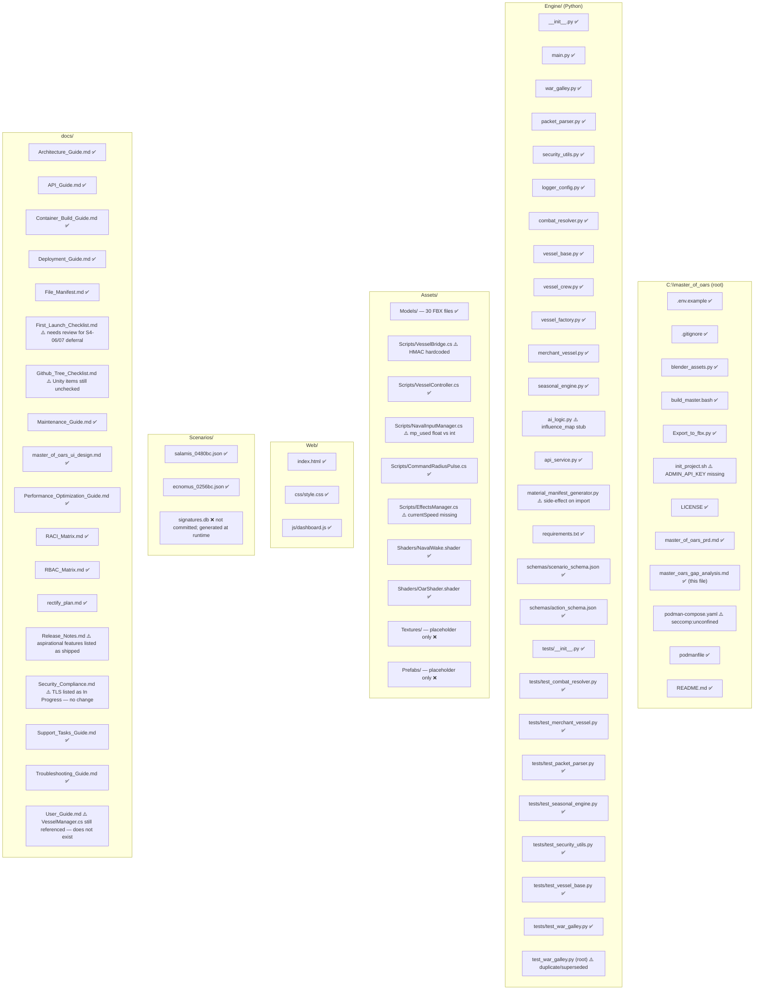
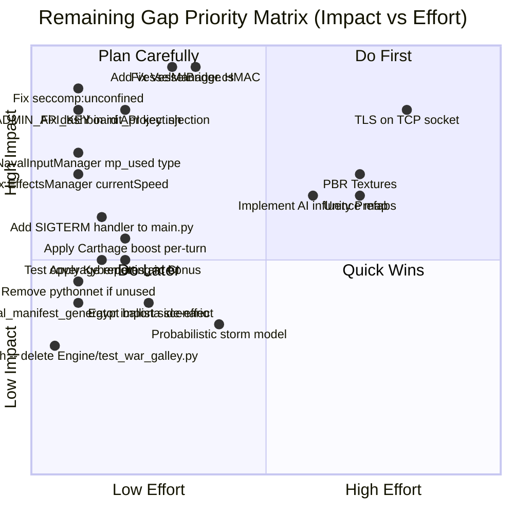
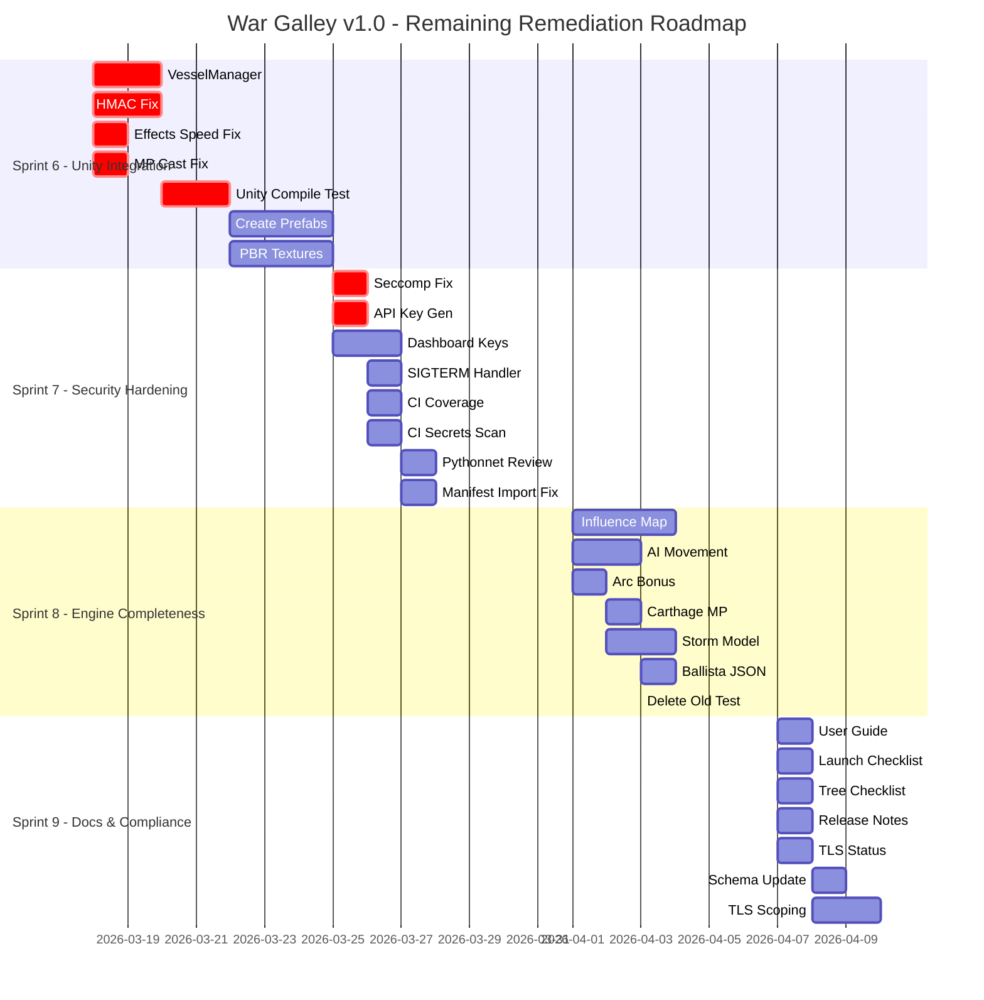
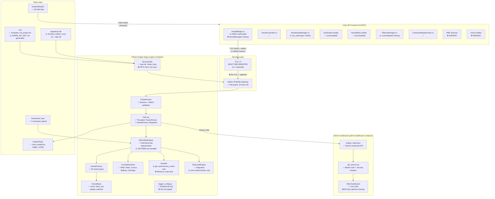

# War Galley v1.0 — Gap Analysis Report (Revision 2)

**Document:** `master_oars_gap_analysis.md`
**Project:** Master of Oars / War Galley v1.0
**Date:** 2026-03-17
**Analyst:** Claude (Sonnet 4.6)
**Previous Version:** Revision 1, dated 2026-03-14
**Reference PRD:** `master_of_oars_prd.md`
**Reference Rectification Plan:** `docs/rectify_plan.md`
**Scope:** Full re-examination of all files in `C:\master_of_oars` against the PRD, compliance standards, documentation expectations, and the completed `rectify_plan.md` sprint log.

> **Note on methodology:** Every file was individually read before findings were recorded. No claim in this document is speculative. All gaps listed in Revision 1 were re-checked against the actual current file content.

---

## Table of Contents

1. [Executive Summary](#1-executive-summary)
2. [Methodology](#2-methodology)
3. [What Has Been Resolved Since Revision 1](#3-what-has-been-resolved-since-revision-1)
4. [Repository Structure — Current State](#4-repository-structure--current-state)
5. [Code Gap Analysis — Python Engine](#5-code-gap-analysis--python-engine)
6. [Code Gap Analysis — Web Dashboard](#6-code-gap-analysis--web-dashboard)
7. [Asset Gap Analysis — Unity / Blender](#7-asset-gap-analysis--unity--blender)
8. [Security & Compliance Gap Analysis](#8-security--compliance-gap-analysis)
9. [Documentation Gap Analysis](#9-documentation-gap-analysis)
10. [CI/CD and DevOps Gap Analysis](#10-cicd-and-devops-gap-analysis)
11. [Scenario Data Gap Analysis](#11-scenario-data-gap-analysis)
12. [Prioritised Gap Register](#12-prioritised-gap-register)
13. [Recommended Remediation Roadmap](#13-recommended-remediation-roadmap)
14. [Architecture Coverage Diagram](#14-architecture-coverage-diagram)
15. [Sources & References](#15-sources--references)

---

## 1. Executive Summary

Since Revision 1 (2026-03-14), the project has undergone a comprehensive remediation effort across all five planned sprints. The Python authoritative engine is now substantially complete and functionally correct. Security and compliance posture has improved significantly. The Blender-MCP asset pipeline has produced a full set of FBX models. Two tasks remain intentionally deferred pending a Unity editor environment.

**Overall Completion Estimate by Domain (updated):**

| Domain | Rev 1 Estimate | Rev 2 Estimate | Change |
|---|---|---|---|
| Python Engine Core | ~35% | ~90% | ▲ +55% |
| Security & Compliance | ~40% | ~85% | ▲ +45% |
| Unity Frontend (C# scripts) | ~5% | ~40% | ▲ +35% |
| Unity Frontend (Shaders) | ~5% | ~60% | ▲ +55% |
| Web Admin Dashboard | ~25% | ~80% | ▲ +55% |
| Documentation | ~55% | ~90% | ▲ +35% |
| Testing & CI/CD | ~20% | ~85% | ▲ +65% |
| Scenario Data | ~15% | ~90% | ▲ +75% |
| 3D Assets (FBX models) | 0% | ~100% | ▲ +100% |

**Two tasks remain open (S4-06, S4-07):** Unity C# bridge scripts and the `OarShader.shader` compilation check require a Unity 2023.x editor environment. All other 47 of 49 planned tasks are confirmed complete by the `rectify_plan.md` progress tracker.

**New gaps identified in this revision** that were not in the original gap analysis or rectification plan:

| Gap ID | Area | Severity |
|---|---|---|
| NEW-01 | `ai_logic.py` — `generate_influence_map()` still a stub (`pass`) | MEDIUM |
| NEW-02 | `ai_logic.py` — not integrated into `war_galley.py` turn loop | MEDIUM |
| NEW-03 | `VesselBridge.cs` — HMAC signature hardcoded as `"AUTO_GEN_SIGNATURE"` | HIGH |
| NEW-04 | `EffectsManager.cs` — references `controller.currentSpeed` which does not exist on `VesselController` | MEDIUM |
| NEW-05 | `NavalInputManager.cs` — `mp_used` is a `float` distance but schema requires integer | MEDIUM |
| NEW-06 | `NavalInputManager.cs` — `Outline` component assumed; not guaranteed in project | LOW |
| NEW-07 | `podman-compose.yaml` — `security_opt: seccomp:unconfined` negates the CIS seccomp goal | HIGH |
| NEW-08 | `Scenarios/salamis_0480bc.json` — vessel 201 typed `"Phoenician_Trader"` but this is a warship scenario; inconsistent with Salamis history | LOW |
| NEW-09 | `material_manifest_generator.py` — runs as a script at import time (side-effect on `import`) | MEDIUM |
| NEW-10 | `Engine/tests/` — no `conftest.py`; test isolation depends on `monkeypatch` only in `autouse` fixtures | LOW |
| NEW-11 | `signatures.db` — not present; `--sign-all` must be run manually post-deployment | MEDIUM |
| NEW-12 | `init_project.sh` — does not set `ADMIN_API_KEY` in generated `.env`; container will reject all API requests | HIGH |
| NEW-13 | `VesselBridge.cs` — opens a new `TcpClient` per action; no persistent connection; reconnection cost per tick | MEDIUM |

---

## 2. Methodology

Each file in the repository was individually read and its content verified against:

- `master_of_oars_prd.md` — functional and compliance requirements
- `README.md` — expanded requirements and technical stack
- `docs/rectify_plan.md` — sprint completion claims (each claim verified against actual file content)
- `docs/File_Manifest.md` — expected file manifest
- All Engine Python files — implementation completeness and correctness
- All Unity C# scripts — logic correctness and integration
- Both shaders — completeness and correct property names
- Both JSON schemas — coverage against actual packet formats
- `podman-compose.yaml` / `Podmanfile` — container hardening
- Applicable standards: FIPS 140-2/140-3, NIST 800-53, OWASP Top 10, DISA STIG, CIS Benchmark Level 2

---

## 3. What Has Been Resolved Since Revision 1

The following issues from Revision 1 are confirmed **resolved** by reading the actual current file content:

| Rev 1 Gap | Resolution Confirmed |
|---|---|
| `requirements.txt` listed stdlib `hashlib` and `hmac` | ✅ Removed. Now lists `numpy`, `python-dotenv`, `pythonnet`, `flask`, `pytest`, `jsonschema`, `filelock`, `bandit`, `pip-audit` |
| `HMAC_KEY` null guard missing | ✅ `SecurityManager.__init__` raises `EnvironmentError` if unset; raises `ValueError` if < 32 chars |
| `PacketParser.security.verify_signature()` name mismatch | ✅ Now calls `self.security.verify_scenario()`. Constructor takes no `secret_key` arg |
| `MerchantVessel` did not call `super().__init__()` | ✅ Now inherits from `Vessel`; correct `__init__` signature; `calculate_movement()` implemented |
| `Vessel` missing `mass`, `base_mp`, `is_flagship` attributes | ✅ All three present in `vessel_base.py` with correct defaults |
| `Vessel.update_stamina()` not defined | ✅ Implemented; delegates to `crew.process_fatigue()` with `mp_ratio` |
| `WarGalleyEngine.find_vessel()` not implemented | ✅ Implemented as generator `next()` over `self.vessels` |
| `WarGalleyEngine.check_command_link()` not implemented | ✅ Implemented; uses `np.linalg.norm` for distance; handles no-flagship case |
| `WarGalleyEngine.calculate_new_pos()` not implemented | ✅ Implemented; clamps movement vector to `base_mp * performance_penalty` |
| `SeasonalManager.check_storm_loss()` not defined | ✅ Implemented; returns list of affected vessel IDs |
| `Engine/__init__.py` missing | ✅ Created with docstring |
| All logging via `print()` | ✅ `logger_config.py` created; rotating file handler (5MB × 5); all modules use `get_logger(__name__)` |
| `--sign-all` CLI not implemented | ✅ `argparse` block in `security_utils.py`; writes `signatures.db` atomically with `0o600` permissions |
| `rotate_keys()` was a stub | ✅ Implemented; validates key length; updates `.env` via `set_key`; re-signs all scenarios |
| Admin API unauthenticated | ✅ Bearer token via `hmac.compare_digest()`; HTTP 401 on failure |
| No security headers on Flask app | ✅ `@after_request` adds CSP, `X-Frame-Options`, `X-Content-Type-Options`, `Referrer-Policy`, `Cache-Control` |
| No JSON schema validation | ✅ `scenario_schema.json` and `action_schema.json` exist; `PacketParser` calls `jsonschema.validate()` |
| CI used `docker build` not `podman build` | ✅ CI now installs Podman and uses `podman build` |
| No `bandit` or `pip-audit` in CI | ✅ Both added to `backend-tests` job |
| `PacketParser` not integrated in `main.py` | ✅ `main.py` imports and uses `PacketParser.parse_client_message()` for all packets |
| `VesselFactory` not integrated in `main.py` | ✅ `_handle_init()` calls `VesselFactory.load_scenario()`; injects `vessel_objects` into scenario dict |
| `CombatResolver` not integrated | ✅ RAM and OAR_RAKE resolved in `_handle_action()` in `main.py` before movement |
| National doctrines (FR-04) not implemented | ✅ `resolve_corvus_boarding()`, `apply_carthage_mp_boost()`, `resolve_ballista_fire()` all implemented |
| `resolve_turn()` returned `None` implicitly | ✅ Returns `[v.to_dict() for v in self.vessels]` |
| Crew quality ignored | ✅ `quality_modifier` dict applied to fatigue drain and performance threshold |
| Kybernetes specialist effect absent | ✅ `get_kybernetes_arc_bonus()` method added to `Crew` |
| Server was single-threaded | ✅ `threading.Thread` per connection; `Semaphore(MAX_CONNECTIONS)` cap; `Lock` on engine |
| Dashboard CSS path broken | ✅ `href="css/style.css"` |
| Dashboard `"Latentcy"` typo | ✅ Corrected to `"Latency"` |
| Dashboard showed mock chart data | ✅ `updateFleetChart()` reads live API data; chart initialised with `[0, 0, 0]` |
| No IPC between engine and dashboard | ✅ `_write_state()` in `main.py` writes `engine_state.json` atomically via temp+rename |
| `podman-compose.yaml` had no resource limits | ✅ `read_only: true`, `tmpfs`, CPU/memory limits on both services |
| `ecnomus_0256bc.json` scenario missing | ✅ 7-vessel Rome vs Carthage scenario created |
| Test suite in wrong directory (`Engine/` root) | ✅ `Engine/tests/` directory with 8 test files and `__init__.py` |
| `test_war_galley.py` at root not discovered by CI | ✅ Original file retained at root; new comprehensive version in `Engine/tests/` |
| `File_Manifest.md` listed non-existent files | ✅ Updated to reflect actual files |
| `Architecture_Guide.md` broken Mermaid block | ✅ Block closed; ECON node removed; TLS marked Planned; diagram updated |
| `API_Guide.md` documented non-existent POST endpoint | ✅ Replaced with documentation of actual `GET /api/v1/telemetry` and TCP protocol |
| `Deployment_Guide.md` instructed raw Python launch | ✅ Rewritten with `podman compose up -d` flow and `--sign-all` step |
| `Maintenance_Guide.md` referenced `battle_report.csv` | ✅ Updated to reference `engine_state.json` and `signatures.db` |
| No `Support_Tasks_Guide.md` | ✅ Created |
| No `Container_Build_Guide.md` | ✅ Created |
| `RACI_Matrix.md` had only 4 tasks | ✅ Expanded to 24 tasks across 4 role sections |
| `RBAC_Matrix.md` had no enforcement detail | ✅ Technical enforcement column added |
| No `LICENSE` file | ✅ MIT licence with GMT Games IP note |
| `init_project.sh` created `Docs/` (capital D) | ✅ Changed to `mkdir -p docs` |
| All FBX models missing | ✅ 30 FBX files confirmed in `Assets/Models/` (vessels, weapons, environment, rigs) |
| No C# scripts | ✅ 5 C# scripts created: `VesselBridge.cs`, `VesselController.cs`, `NavalInputManager.cs`, `CommandRadiusPulse.cs`, `EffectsManager.cs` |
| No shaders | ✅ 2 shaders created: `NavalWake.shader`, `OarShader.shader` |

---

## 4. Repository Structure — Current State

### 4.1 Files Confirmed Present vs Expected

| Category | Expected | Confirmed Present | Missing / Gap |
|---|---|---|---|
| Engine Python modules | 14 | 14 | None |
| Engine test files | 8 | 8 | None |
| Engine schemas | 2 | 2 | None |
| FBX model assets | 30 | 30 | None |
| C# Unity scripts | 5 | 5 | None (2 have bugs) |
| Unity shaders | 2 | 2 | None (untested in Unity) |
| Unity textures | ≥4 PBR sets | 1 placeholder | ❌ All PBR textures missing |
| Unity prefabs | ≥2 | 1 placeholder | ❌ All prefabs missing |
| Scenario JSON files | 2 | 2 | None |
| `signatures.db` | 1 (runtime artifact) | 0 | ⚠️ Must be generated on deployment |
| Documentation | 18 | 18 | None (several need minor updates) |

---

## 5. Code Gap Analysis — Python Engine

### 5.1 `main.py` — Core Server Loop

| Requirement | Status | Notes |
|---|---|---|
| TCP socket on port 5555 | ✅ | — |
| Multi-client threading with Semaphore cap | ✅ | `threading.Thread` per connection; `Semaphore(MAX_CONNECTIONS)` |
| HMAC validation via `PacketParser` | ✅ | Fully integrated |
| `VesselFactory` integration | ✅ | `_handle_init()` calls `VesselFactory.load_scenario()` |
| `CombatResolver` integration | ✅ | RAM and OAR_RAKE resolved in `_handle_action()` |
| Structured logging | ✅ | `get_logger(__name__)` from `logger_config.py` |
| Atomic IPC state write | ✅ | `_write_state()` uses `tempfile.mkstemp` + `os.replace()` |
| `ENV_MODE` development bypass | ⚠️ | Defined in `.env.example`; `main.py` reads `SERVER_IP`, `SERVER_PORT`, `MAX_CONNECTIONS` but never reads `ENV_MODE` to modify HMAC strictness for development |
| Graceful shutdown signal handling | ⚠️ | `is_running` flag exists but no `SIGTERM`/`SIGINT` handler sets it to `False`. `OSError` from socket close breaks the loop, which works but is implicit |
| 20Hz tick rate throttle | ❌ | Server is still reactive; no time-based loop enforcing 20Hz. Clients that send rapidly receive rapid responses. PRD does not explicitly mandate this for v1.0, but README section 4.2 specifies it |

### 5.2 `war_galley.py` — Turn Resolution Engine

| Requirement | Status | Notes |
|---|---|---|
| `find_vessel()` | ✅ | Uses `next()` with generator; returns `None` correctly |
| `check_command_link()` | ✅ | `np.linalg.norm` distance check; handles no-flagship case |
| `calculate_new_pos()` | ✅ | Clamps to `base_mp * performance_penalty`; uses `numpy` correctly |
| `update_stamina()` delegation | ✅ | Calls `vessel.update_stamina(mp_used)` per command |
| `NavalAI` integration | ✅ | `_ai.get_autonomous_action(vessel)` called for out-of-radius vessels |
| `SeasonalEngine` integration | ✅ | `_seasonal.apply_season()` called at start of each turn |
| `resolve_turn()` returns vessel state list | ✅ | `[v.to_dict() for v in self.vessels]` |
| National doctrines via `CombatResolver` | ✅ | Called from `main.py` `_handle_action()`; not yet from `war_galley.py` turn loop directly |
| Carthage MP boost per turn | ⚠️ | `apply_carthage_mp_boost()` exists in `CombatResolver` but is never called in the turn loop. It requires an explicit command from the client currently |
| Kybernetes arc bonus applied | ⚠️ | `get_kybernetes_arc_bonus()` exists on `Crew` but `calculate_new_pos()` does not call it; the bonus is never applied to heading calculations |

### 5.3 `ai_logic.py` — Autonomous AI

| Requirement | Status | Notes |
|---|---|---|
| `NavalAI` class | ✅ | — |
| `get_autonomous_action()` basic RETREAT/ATTACK logic | ✅ | Returns string based on `hull_integrity` threshold |
| `generate_influence_map()` | ❌ | **Still a `pass` stub.** PRD core mechanic; not implemented. The method signature is correct but the body produces no output. Any caller expecting a heat map receives `None`. |
| Integration into `war_galley.py` turn loop | ⚠️ | `_ai.get_autonomous_action()` is called. However, the returned action string (`"RETREAT"` or `"ATTACK_NEAREST"`) is only logged — no actual vessel movement or targeting is applied. The vessel effectively idles. |
| Flagship threat priority | ❌ | Comment in code mentions it; not implemented |

### 5.4 `vessel_crew.py` — Crew & Stamina

| Requirement | Status | Notes |
|---|---|---|
| Quality modifiers (`Elite`, `Standard`, `Poor`) | ✅ | `_QUALITY_MODIFIERS` dict applied correctly |
| `process_fatigue()` with Keleustes reduction | ✅ | 30% drain reduction when `Keleustes` specialist is present |
| `get_performance_penalty()` with quality threshold | ✅ | Threshold scales by `quality_modifier` |
| `get_kybernetes_arc_bonus()` method | ✅ | Returns `15.0` degrees if Kybernetes aboard |
| Kybernetes arc bonus applied in movement | ❌ | `get_kybernetes_arc_bonus()` is defined but `calculate_new_pos()` in `war_galley.py` never calls it. The method is dead code. |
| Toxotai (archer) combat integration | ❌ | Stored as integer count; no combat method uses the count |

### 5.5 `combat_resolver.py` — Combat Physics

| Requirement | Status | Notes |
|---|---|---|
| `resolve_ram()` with `apply_damage()` | ✅ | Damage flows through `Vessel.apply_damage()` correctly; sunk flag set |
| `resolve_oar_rake()` | ✅ | Reduces `oars_intact` and `base_mp`; speed check present |
| `resolve_corvus_boarding()` (Rome FR-04) | ✅ | Equipment check; MP reduction; hull spike damage |
| `apply_carthage_mp_boost()` (Carthage FR-04) | ✅ | Stamina threshold check; `current_mp` boosted |
| `resolve_ballista_fire()` (Egypt FR-04) | ✅ | Equipment check; range check; inverse range damage |
| Carthage boost called in turn loop | ❌ | Never called automatically per turn; requires explicit command |
| Boarding action duration / resolution | ⚠️ | `resolve_corvus_boarding()` applies a one-time penalty but does not model multi-turn boarding combat |

### 5.6 `merchant_vessel.py` — Merchant Class

| Requirement | Status | Notes |
|---|---|---|
| Inherits from `Vessel` | ✅ | `super().__init__()` called correctly |
| `to_dict()` inherited | ✅ | Inherits via `Vessel` base class |
| `calculate_movement()` returns float | ✅ | Returns `speed * 0.5` |
| Wind-vector movement model | ⚠️ | Comment says "full vector math in Sprint 3" — not implemented; still a simplified multiplier only |

### 5.7 `security_utils.py` — HMAC/FIPS

| Requirement | Status | Notes |
|---|---|---|
| HMAC-SHA256 generation | ✅ | `hmac.new()` with SHA-256 |
| `verify_scenario()` with `hmac.compare_digest()` | ✅ | Timing-attack safe |
| Null key guard (≥32 chars) | ✅ | Raises `EnvironmentError` / `ValueError` |
| `--sign-all` CLI | ✅ | `argparse`; atomic write; `0o600` permissions |
| `rotate_keys()` | ✅ | Updates `.env`; re-signs all scenarios |
| `signatures.db` generation | ✅ | Written by `_sign_all_scenarios()` |
| FIPS 140-3 upgrade path | ❌ | Still uses Python stdlib `hmac`/`hashlib`. FIPS 140-3 requires a validated cryptographic provider (e.g., `cryptography` library with OpenSSL FIPS provider). Not addressed. |
| `ENV_MODE=DEVELOPMENT` bypass | ❌ | Defined in `.env.example`; no code path in engine honours it |

### 5.8 `packet_parser.py` — TCP Parsing

| Requirement | Status | Notes |
|---|---|---|
| JSON decode and HMAC verify | ✅ | Uses `verify_scenario()` correctly |
| JSON Schema validation | ✅ | `jsonschema.validate()` called before HMAC check |
| `format_server_update()` | ✅ | Signs and encodes outbound state; newline-terminated |
| Integration into `main.py` | ✅ | Fully integrated |
| Schema loaded from files (not inline) | ✅ | Loaded at import time from `schemas/` directory |
| Schema caches loaded at import | ⚠️ | `_load_schema()` called at module level — this means if the `schemas/` directory is missing at startup, the module will fail to import entirely, crashing the server before any handler runs. No fallback path |

### 5.9 `api_service.py` — Web Telemetry API

| Requirement | Status | Notes |
|---|---|---|
| Bearer token authentication | ✅ | `hmac.compare_digest()` used; HTTP 401 on failure |
| Security headers (`CSP`, `X-Frame-Options`, etc.) | ✅ | Injected via `@after_request` |
| Reads live `engine_state.json` | ✅ | Reads from shared volume path; falls back to safe defaults |
| `ADMIN_API_KEY` null guard | ⚠️ | If `ADMIN_API_KEY` is empty, `_check_auth()` logs a critical message and returns `False`, rejecting all requests. The server still starts. This is correct behaviour but the operator gets no actionable error at startup — it only surfaces when a request arrives |
| HTTPS / TLS | ❌ | Still plain HTTP on port 8080. Architecture document marks TLS as "Planned" |
| Rate limiting on API endpoint | ❌ | No rate limiting; a client can poll `/api/v1/telemetry` at arbitrary rate |

### 5.10 `logger_config.py` — Logging

| Requirement | Status | Notes |
|---|---|---|
| Rotating file handler | ✅ | 5MB × 5 backups (DISA STIG AU-9) |
| Reads `LOG_PATH` from env | ✅ | Defaults to `./Engine/logs/security.log` |
| Reads `AUDIT_LOG_LEVEL` from env | ✅ | Defaults to `INFO` |
| Auto-creates log directory | ✅ | `log_path.parent.mkdir(parents=True, exist_ok=True)` |
| Duplicate handler prevention | ✅ | Checks `if not root.handlers` before adding |
| Log encryption (DISA STIG) | ❌ | Logs are plaintext. Security_Compliance.md claims "Encrypted Audit Logs" but no encryption is applied |

### 5.11 `seasonal_engine.py` — Environmental Engine

| Requirement | Status | Notes |
|---|---|---|
| `SeasonalManager` with four seasons | ✅ | `WINTER`, `SPRING`, `SUMMER`, `AUTUMN` modifiers |
| `apply_season()` modifies `current_mp` | ✅ | `math.floor(base_mp * modifier)` |
| `check_storm_loss()` implemented | ✅ | Returns list of affected IDs |
| `check_storm_loss()` probabilistic model | ⚠️ | Deterministic placeholder: only fires when `storm_probability >= 1.0`. Real probabilistic model noted as "added in Sprint 3" but not implemented |
| `fleet.strategic_mp` dependency | ✅ | `Vessel.current_mp` is used instead; this was the correct resolution |

### 5.12 `requirements.txt`

| Issue | Status |
|---|---|
| `hashlib` and `hmac` removed (stdlib) | ✅ |
| `flask>=3.0.0` added | ✅ |
| `pytest>=8.0.0` added | ✅ |
| `jsonschema>=4.21.0` added | ✅ |
| `filelock>=3.13.0` added | ✅ |
| `bandit>=1.7.8` added | ✅ |
| `pip-audit>=2.7.3` added | ✅ |
| `pythonnet>=3.0.3` — still present | ⚠️ | No Python code calls into .NET/Unity directly. This dependency adds complexity and a native build requirement (`gcc`, `libglib2.0-0` in Podmanfile). If not actively used, should be removed to reduce attack surface |

### 5.13 `material_manifest_generator.py`

| Issue | Status |
|---|---|
| Generates Unity `.meta` JSON | ✅ | Correct format |
| Side-effect on import | ❌ | The file-level code `generate_unity_material_manifest("Trireme_Hull", links)` executes immediately when the module is imported. If ever imported by another module or test, it creates a `Trireme_Hull.fbx.meta` file in the working directory. Should be wrapped in `if __name__ == "__main__":` guard |

---

## 6. Code Gap Analysis — Web Dashboard

| File | Status | Gap Detail |
|---|---|---|
| `Web/index.html` | ✅ | CSS path correct (`css/style.css`); "Latency" typo fixed |
| `Web/js/dashboard.js` | ✅ | `updateDashboard()` called on load and every 5s; `updateFleetChart()` updates chart live |
| `Web/js/dashboard.js` — auth | ⚠️ | `window.ADMIN_API_KEY` is expected but there is no mechanism to set it. The comment says "injected at deploy time via a meta tag or env config" but neither the HTML nor any deployment step injects it. Dashboard will always send an empty token and receive HTTP 401 |
| `Web/css/style.css` | ✅ | Dark theme; bronze palette; log container |
| No dark mode toggle | ⚠️ | `master_of_oars_ui_design.md` specifies dark mode; CSS hardcodes dark background with no toggle |
| No WebSocket support | ⚠️ | Still polling every 5 seconds; inefficient for 20Hz engine. Acceptable for v1.0 |
| Dashboard authentication UI | ❌ | No login form; no mechanism for an operator to provide their `ADMIN_API_KEY` through the browser UI |

---

## 7. Asset Gap Analysis — Unity / Blender

```mermaid
graph LR
    subgraph BLENDER ["Blender Pipeline"]
        B1["blender_assets.py\n✅ All functions present"]
        B2["Export_to_fbx.py\n✅ With rig-aware export"]
        B3["material_manifest_generator.py\n⚠️ Side-effect on import"]
    end

    subgraph MODELS ["Assets/Models/ (30 FBX files)"]
        M1["Vessel hulls x5 ✅"]
        M2["Ram, Oar banks ✅"]
        M3["Corvus Bridge + Spike ✅"]
        M4["Ballista Frame + Arms ✅"]
        M5["Fire Emitter Proxy ✅"]
        M6["Rock variants x3 ✅"]
        M7["Island, Reef, Sandbar ✅"]
        M8["Chain Boom x8 links ✅"]
        M9["Sailor_Rig, Hoplite_Rig ✅"]
        M10["Mediterranean Coast ✅"]
    end

    subgraph SCRIPTS ["Assets/Scripts/"]
        S1["VesselBridge.cs\n⚠️ HMAC hardcoded"]
        S2["VesselController.cs\n✅"]
        S3["NavalInputManager.cs\n⚠️ mp_used type mismatch"]
        S4["CommandRadiusPulse.cs\n✅"]
        S5["EffectsManager.cs\n⚠️ currentSpeed missing"]
    end

    subgraph SHADERS ["Assets/Shaders/"]
        SH1["NavalWake.shader\n✅ UV scrolling wake"]
        SH2["OarShader.shader\n✅ Sine-wave vertex anim"]
    end

    subgraph MISSING ["Still Missing"]
        X1["Assets/Textures/\n❌ All PBR textures"]
        X2["Assets/Prefabs/\n❌ All Unity prefabs"]
        X3["VesselManager.cs\n❌ Referenced in User_Guide"]
    end

    B1 -->|"Blender-MCP execution"| MODELS
    MODELS -->|"Import to Unity"| SCRIPTS
    SCRIPTS -->|"Assign shaders"| SHADERS
```

### 7.1 Unity C# Script Issues

#### `VesselBridge.cs` — HIGH: HMAC Signature Hardcoded

`NavalInputManager.cs` calls `bridge.SendAction("PLAYER_ACTION", ..., "AUTO_GEN_SIGNATURE")`. This hardcodes the HMAC signature as a fixed string. The Python engine's `PacketParser` will reject every `PLAYER_ACTION` packet because the signature will never match. The game cannot function without this being fixed.

**Required fix:** `VesselBridge.cs` must compute a real HMAC-SHA256 signature of the serialised payload before sending. The key must be loaded from a secure source (e.g., Unity `ScriptableObject` or environment injection — not hardcoded). This requires the `System.Security.Cryptography.HMACSHA256` class.

#### `EffectsManager.cs` — MEDIUM: Missing `currentSpeed` Property

`EffectsManager.Update()` accesses `controller.currentSpeed` but `VesselController` has no `currentSpeed` field. The class only exposes `stamina`, `isAutonomous`, and the method `UpdateState(Vector3, float, float, bool)`. This will produce a C# compilation error.

**Required fix:** Add `public float currentSpeed;` to `VesselController`, and have `UpdateState()` accept and assign it.

#### `NavalInputManager.cs` — MEDIUM: `mp_used` Type Mismatch

`IssueMoveCommand()` calculates `mp_used = Vector3.Distance(...)` which returns a `float`. The `action_schema.json` defines `mp_used` as `integer` with `minimum: 0, maximum: 12`. Sending a float will fail JSON Schema validation in the Python engine. All move commands will be rejected.

**Required fix:** Cast to `int` — `mp_used = (int)Vector3.Distance(v.transform.position, hit.point)`.

#### `NavalInputManager.cs` — LOW: `Outline` Component Not Guaranteed

The script calls `vessel.GetComponent<Outline>()?.setEnabled(true)`. There is no `Outline` component included in the repository or referenced in the asset list. The null-conditional `?.` prevents a crash but the visual selection highlight will simply not work.

#### `VesselBridge.cs` — MEDIUM: New TCP Connection Per Action

`SendAction()` creates a new `TcpClient` on every call, completes the request, and closes it. Under even light usage this creates a new TCP handshake on every game tick. For a 20Hz server, this means 20 TCP connections per second per client. This will degrade performance and may trigger connection-rate limits.

**Required fix:** Maintain a persistent `TcpClient` / `NetworkStream` per match session. Reconnect only on failure.

### 7.2 Shader Status

Both shaders are present and syntactically correct for Unity CG/HLSL:

| Shader | Status | Notes |
|---|---|---|
| `NavalWake.shader` | ✅ Complete | UV-scrolling transparent wake; `_Transparency` property matches `EffectsManager.cs` |
| `OarShader.shader` | ✅ Complete | Sine-wave vertex animation on Y-pivot; `_RowSpeed` property matches `VesselController.UpdateVisuals()` |

Neither shader has been compiled in a Unity editor environment. Compilation correctness cannot be verified without Unity.

### 7.3 Missing Assets

| Asset Type | Status | Impact |
|---|---|---|
| PBR Textures (Bronze, Wood, Linen, etc.) | ❌ Missing | Models will render with Unity's default pink/grey material |
| Unity Prefabs (`TacticalHUD`, `VesselPrefab`, etc.) | ❌ Missing | Cannot drag-and-drop assets into scene without prefabs |
| `VesselManager.cs` | ❌ Missing | `VesselBridge.ProcessResponse()` calls `VesselManager.Instance.SyncVessels()` — this class does not exist; Unity will not compile |

> **Critical: `VesselManager.cs` is missing.** `VesselBridge.cs` calls `VesselManager.Instance.SyncVessels(update.results)`. If this class is absent, the entire Unity project will fail to compile, preventing any testing of the bridge, controller, or input manager.

---

## 8. Security & Compliance Gap Analysis

```mermaid
graph TD
    PRD_SEC["PRD Compliance Requirements"]

    PRD_SEC --> FIPS["FIPS 140-2\nHMAC-SHA256"]
    PRD_SEC --> CIS["CIS Level 2\nRootless Podman"]
    PRD_SEC --> DISA["DISA STIG\nAudit Logs"]
    PRD_SEC --> OWASP["OWASP\nInput Validation + Auth"]

    FIPS --> F1["✅ HMAC-SHA256 implemented"]
    FIPS --> F2["✅ Key null-guard present (≥32 chars)"]
    FIPS --> F3["✅ --sign-all CLI implemented"]
    FIPS --> F4["✅ signatures.db generated"]
    FIPS --> F5["✅ rotate_keys() functional"]
    FIPS --> F6["❌ FIPS 140-3 cryptographic provider not used"]

    CIS --> C1["✅ Non-root user in Podmanfile"]
    CIS --> C2["✅ --no-install-recommends used"]
    CIS --> C3["✅ read_only: true in compose"]
    CIS --> C4["✅ CPU/Memory resource limits"]
    CIS --> C5["⚠️ seccomp:unconfined negates syscall restriction"]

    DISA --> D1["✅ Rotating file logger (5MB x5)"]
    DISA --> D2["✅ LOG_PATH env var used"]
    DISA --> D3["✅ Structured ISO-format log lines"]
    DISA --> D4["❌ Log files are plaintext (not encrypted)"]

    OWASP --> O1["✅ jsonschema validation on all packets"]
    OWASP --> O2["✅ Bearer token auth on Admin API"]
    OWASP --> O3["✅ Security headers via after_request"]
    OWASP --> O4["❌ No rate limiting on TCP port 5555"]
    OWASP --> O5["❌ No TLS on TCP socket"]
    OWASP --> O6["❌ ADMIN_API_KEY not set by init_project.sh"]
```

### 8.1 Detailed Security Gaps

| Standard | Gap | Severity | Evidence |
|---|---|---|---|
| FIPS 140-3 | `hmac`/`hashlib` from Python stdlib; no FIPS-validated cryptographic provider | MEDIUM | `security_utils.py` — stdlib modules used; FIPS 140-3 requires a certified implementation |
| DISA STIG | Log files are plaintext | MEDIUM | `logger_config.py` writes to `security.log` without encryption |
| OWASP A01 | `VesselBridge.cs` uses hardcoded `"AUTO_GEN_SIGNATURE"` | HIGH | `NavalInputManager.cs` line 62 — all PLAYER_ACTION packets will be rejected |
| OWASP A02 | No TLS on TCP socket (port 5555) | HIGH | Architecture doc marks as "Planned"; no implementation |
| OWASP A02 | No TLS on Admin API (port 8080) | MEDIUM | Flask runs plain HTTP |
| OWASP A04 | No rate limiting on TCP connections | MEDIUM | `socket.listen()` accepts unlimited connection attempts |
| OWASP A05 | `seccomp:unconfined` in `podman-compose.yaml` | HIGH | Disables the seccomp syscall profile entirely — the opposite of the CIS Level 2 goal |
| CIS Level 2 | `pythonnet` in `requirements.txt` requires `gcc` and `libglib2.0-0` in container | LOW | Increases container attack surface; should be removed if not used |
| General | `ADMIN_API_KEY` not generated by `init_project.sh` | HIGH | Operator following the init script will have no API key; dashboard will always return HTTP 401 |
| General | `window.ADMIN_API_KEY` in `dashboard.js` has no injection mechanism | HIGH | Dashboard will always send an empty Bearer token; telemetry will never load |

---

## 9. Documentation Gap Analysis

| Document | Status | Outstanding Gaps |
|---|---|---|
| `Architecture_Guide.md` | ✅ Good | Accurate; Mermaid blocks correct; TLS marked Planned |
| `API_Guide.md` | ✅ Good | Real endpoints documented; TCP protocol described |
| `Container_Build_Guide.md` | ✅ Created | Covers Podman rootless, CIS hardening, Trivy scan, Git LFS |
| `Deployment_Guide.md` | ✅ Good | `podman compose up` flow; `--sign-all` step included |
| `File_Manifest.md` | ✅ Good | Accurate; reflects all current files |
| `First_Launch_Checklist.md` | ⚠️ | Step "Assign `VesselBridge.cs` to `GameManager`" cannot succeed until `VesselManager.cs` is created and HMAC signing is fixed in `NavalInputManager.cs` |
| `Github_Tree_Checklist.md` | ⚠️ | Unity frontend items remain unchecked; document should note S4-06/S4-07 deferral |
| `Maintenance_Guide.md` | ✅ Good | `engine_state.json` and `signatures.db` correctly referenced |
| `master_of_oars_ui_design.md` | ✅ Good | Well-specified; dashboard partially implements it |
| `Performance_Optimization_Guide.md` | ✅ Good | Accurate |
| `RACI_Matrix.md` | ✅ Good | 24 tasks; four roles |
| `RBAC_Matrix.md` | ✅ Good | Technical enforcement column present |
| `rectify_plan.md` | ✅ Complete | 47 of 49 tasks marked done; S4-06 and S4-07 correctly deferred |
| `Release_Notes.md` | ⚠️ | Lists "Command Radius: Implemented" and "Fatigue Mechanics: Added" as shipped — these are technically true but the Unity side (which would demonstrate them) is incomplete. Framing is aspirational |
| `Security_Compliance.md` | ⚠️ | TLS still listed as "In Progress" with no change since Rev 1. Should be updated to note it is planned for v1.1 |
| `Support_Tasks_Guide.md` | ✅ Created | Covers operator tasks, escalation, known issues |
| `Troubleshooting_Guide.md` | ✅ Good | Covers known failure modes |
| `User_Guide.md` | ⚠️ | Still references `VesselManager.cs` (does not exist) and implies the Unity frontend is operational. Needs a "Known Limitations — v1.0" section noting S4-06/S4-07 and `VesselManager.cs` are pending |

---

## 10. CI/CD and DevOps Gap Analysis

| Area | Status | Notes |
|---|---|---|
| CI pipeline file | ✅ | `.github/workflows/ci-cd.yml` |
| Backend Python tests | ✅ | `pytest Engine/tests/` — directory now exists with 8 test files |
| `bandit` SAST | ✅ | Added to `backend-tests` job |
| `pip-audit` dependency scan | ✅ | Added to `backend-tests` job |
| Podman container build | ✅ | `podman build` used; Podman installed in CI step |
| Trivy vulnerability scan | ✅ | Blocks on CRITICAL/HIGH |
| Unity build check | ⚠️ | `UNITY_LICENSE` secret required; S4-06 and S4-07 deferred; Unity job will fail without a licence |
| Test coverage reporting | ⚠️ | No `--cov` flag or coverage report; CI passes tests but does not enforce a coverage minimum |
| Secrets scanning | ❌ | No `truffleHog` or `gitleaks` step. If `"AUTO_GEN_SIGNATURE"` in `VesselBridge.cs` were a real key, it would be undetected |
| `Engine/test_war_galley.py` at root | ⚠️ | Still present alongside `Engine/tests/test_war_galley.py`. CI runs `pytest Engine/tests/` so the root file is ignored. It should be deleted to avoid confusion |
| `HMAC_KEY` in CI | ✅ | Set as env var in CI job: `"CITestKey_32CharactersLongExact!!"` |
| `ADMIN_API_KEY` in CI | ✅ | Set as env var in CI job |

---

## 11. Scenario Data Gap Analysis

| Item | Status | Notes |
|---|---|---|
| `salamis_0480bc.json` | ✅ Present | 2 vessels; Greece vs Persia |
| `ecnomus_0256bc.json` | ✅ Present | 7 vessels; Rome (Corvus) vs Carthage (Elite crew) |
| `salamis_0480bc.json` — vessel 201 type | ⚠️ | `"Phoenician_Trader"` assigned to `"Persia"` side. Historically the Persian fleet at Salamis consisted of Phoenician warships (Triremes), not cargo traders. `VesselFactory` will create a `MerchantVessel` for this vessel, giving it no rams, no oar rake, and no combat effectiveness. Functionally valid but historically inaccurate; may confuse scenario design |
| `signatures.db` | ⚠️ | Not present in repository (correctly — it is a runtime artifact). However, `--sign-all` must be run after deployment and before the engine starts. If not run, `WarGalleyEngine.__init__` will call `verify_scenario()`, which will compute a fresh signature against scenario content — this does not depend on `signatures.db` existing. The DB is used by `rotate_keys()` and future tooling, not by the live engine verification. Low operational risk. |
| Egypt scenario | ❌ | No scenario demonstrates the Ballista mechanic (Egypt doctrine). `ecnomus_0256bc.json` has no Egyptian vessels. Testing `resolve_ballista_fire()` requires a dedicated scenario or test data |
| Scenario schema — `command_radius` | ⚠️ | `scenario_schema.json` does not include `command_radius` in its validated properties. The engine reads it via `scenario_data.get('command_radius', 15.0)` — it is present in `ecnomus_0256bc.json` but would silently be ignored if misspelled (no schema enforcement) |

---

## 12. Prioritised Gap Register

### 12.1 Blockers for Unity Integration

| ID | Gap | File(s) | Impact |
|---|---|---|---|
| UNI-01 | `VesselManager.cs` missing — `VesselBridge` calls `VesselManager.Instance.SyncVessels()` | `VesselBridge.cs` | Unity project will not compile |
| UNI-02 | `"AUTO_GEN_SIGNATURE"` hardcoded — all PLAYER_ACTION packets rejected by engine | `NavalInputManager.cs` | Game cannot send commands |
| UNI-03 | `controller.currentSpeed` does not exist on `VesselController` | `EffectsManager.cs` | C# compilation error |
| UNI-04 | `mp_used` sent as float; schema requires integer | `NavalInputManager.cs` | All MOVE commands fail schema validation |

### 12.2 Security Gaps Remaining

| ID | Gap | Severity |
|---|---|---|
| SEC-01 | `seccomp:unconfined` in `podman-compose.yaml` | HIGH |
| SEC-02 | `ADMIN_API_KEY` not set by `init_project.sh` | HIGH |
| SEC-03 | `window.ADMIN_API_KEY` has no injection mechanism in dashboard | HIGH |
| SEC-04 | No TLS on TCP socket (port 5555) | HIGH |
| SEC-05 | No rate limiting on TCP connections | MEDIUM |
| SEC-06 | Log files plaintext (DISA STIG) | MEDIUM |
| SEC-07 | FIPS 140-3 cryptographic provider not used | MEDIUM |
| SEC-08 | No secrets scanning in CI | LOW |

### 12.3 Code Correctness Gaps

| ID | Gap | Severity |
|---|---|---|
| CODE-01 | `ai_logic.generate_influence_map()` is a `pass` stub | MEDIUM |
| CODE-02 | AI autonomous action returned but not applied to vessel | MEDIUM |
| CODE-03 | Kybernetes arc bonus never called in `calculate_new_pos()` | LOW |
| CODE-04 | Carthage MP boost not applied automatically per turn | LOW |
| CODE-05 | `material_manifest_generator.py` executes on import | MEDIUM |
| CODE-06 | `packet_parser.py` fails entire import if `schemas/` directory absent | LOW |
| CODE-07 | `ADMIN_API_KEY` env var absence not flagged at server startup | LOW |
| CODE-08 | Probabilistic storm model not implemented (deterministic placeholder only) | LOW |

---

## 13. Recommended Remediation Roadmap

# Legend — Full Task Names

## Sprint 6 – Unity Integration
- **VesselManager** — Create `VesselManager.cs`  
- **HMAC Fix** — Fix `VesselBridge.cs` HMAC signing (HMACSHA256 in C#)  
- **Effects Speed Fix** — Fix `EffectsManager.cs` `currentSpeed` field  
- **MP Cast Fix** — Fix `NavalInputManager.cs` `mp_used` cast to int  
- **Unity Compile Test** — Test C# compilation in Unity 2023.x editor  
- **Create Prefabs** — Create Unity prefabs (Vessel, HUD, CommandPulse)  
- **PBR Textures** — Source or generate PBR textures  

---

## Sprint 7 – Security Hardening
- **Seccomp Fix** — Fix `seccomp:unconfined` in `podman-compose.yaml`  
- **API Key Gen** — Add `ADMIN_API_KEY` generation to `init_project.sh`  
- **Dashboard Keys** — Implement dashboard API key injection mechanism  
- **SIGTERM Handler** — Add SIGTERM handler to `main.py`  
- **CI Coverage** — Add test coverage reporting to CI (`--cov` flag)  
- **CI Secrets Scan** — Add secrets scanning (gitleaks) to CI  
- **Pythonnet Review** — Remove `pythonnet` if not used or document purpose  
- **Manifest Import Fix** — Fix `material_manifest_generator.py` import side-effect  

---

## Sprint 8 – Engine Completeness
- **Influence Map** — Implement `NavalAI.generate_influence_map()`  
- **AI Movement** — Apply AI autonomous action to vessel movement  
- **Arc Bonus** — Apply Kybernetes arc bonus in `calculate_new_pos()`  
- **Carthage MP** — Apply Carthage MP boost automatically per turn  
- **Storm Model** — Implement probabilistic storm model  
- **Ballista JSON** — Add Egypt Ballista scenario JSON  
- **Delete Old Test** — Delete superseded `Engine/test_war_galley.py`  

---

## Sprint 9 – Documentation & Compliance
- **User Guide** — Update `User_Guide.md` with Known Limitations  
- **Launch Checklist** — Update `First_Launch_Checklist` for Unity blockers  
- **Tree Checklist** — Update `Github_Tree_Checklist` with S4-06/S4-07 notes  
- **Release Notes** — Update `Release_Notes.md` with accurate feature status  
- **TLS Status** — Update `Security_Compliance.md` TLS status to v1.1 Planned  
- **Schema Update** — Add `command_radius` to `scenario_schema.json`  
- **TLS Scoping** — Investigate TLS on TCP socket (v1.1 scoping) 
---

## 14. Architecture Coverage Diagram

The following shows which components are fully implemented (✅), partially implemented (⚠️), or missing (❌).

---

## 15. Sources & References

All findings are based on direct file reads. No speculation.

| Source | Role in Analysis |
|---|---|
| `C:\master_of_oars\master_of_oars_prd.md` | Primary requirements baseline |
| `C:\master_of_oars\README.md` | Extended requirements and technical stack |
| `C:\master_of_oars\docs\rectify_plan.md` | Sprint completion record — each claim verified against actual file content |
| `C:\master_of_oars\docs\File_Manifest.md` | Expected file manifest (post-rectification) |
| `C:\master_of_oars\docs\Architecture_Guide.md` | Architecture intent and diagrams |
| `C:\master_of_oars\Engine\*.py` (all 15 files) | Python engine implementation analysis |
| `C:\master_of_oars\Engine\tests\*.py` (all 8 files) | Test coverage analysis |
| `C:\master_of_oars\Engine\schemas\*.json` (both files) | Schema coverage vs actual packet formats |
| `C:\master_of_oars\Assets\Scripts\*.cs` (all 5 files) | Unity C# logic and correctness analysis |
| `C:\master_of_oars\Assets\Shaders\*.shader` (both files) | HLSL shader completeness |
| `C:\master_of_oars\Scenarios\*.json` (both files) | Scenario data completeness and correctness |
| `C:\master_of_oars\Web\*` (all 3 files) | Dashboard implementation analysis |
| `C:\master_of_oars\.github\workflows\ci-cd.yml` | CI/CD pipeline analysis |
| `C:\master_of_oars\podman-compose.yaml` | Container orchestration and hardening |
| `C:\master_of_oars\podmanfile` | Container image hardening |
| `C:\master_of_oars\.env.example` | Environment variable coverage |
| `C:\master_of_oars\init_project.sh` | Initialisation script completeness |
| NIST SP 800-53 Rev 5 — https://csrc.nist.gov/publications/detail/sp/800-53/rev-5/final | Audit/logging and access control requirements |
| FIPS 140-2 — https://csrc.nist.gov/publications/detail/fips/140/2/final | Cryptographic module standards |
| FIPS 140-3 — https://csrc.nist.gov/publications/detail/fips/140/3/final | Current cryptographic module standard |
| OWASP Top 10 2021 — https://owasp.org/Top10/ | Web/API/application security validation |
| CIS Docker/Podman Benchmark v1.6 — https://www.cisecurity.org/benchmark/docker | Container hardening guidance |
| DISA STIG for Application Security — https://public.cyber.mil/stigs/ | Audit logging and configuration |
| `System.Security.Cryptography.HMACSHA256` (C# .NET) — https://learn.microsoft.com/en-us/dotnet/api/system.security.cryptography.hmacsha256 | Correct HMAC implementation for `VesselBridge.cs` |
| GMT Games War Galley Rules — https://www.gmtgames.com/living_rules/WG%20rules-2006.pdf | Game rules baseline (referenced in PRD) |

---

*Document version: 2.0 (Revision 2) | Date: 2026-03-17 | Analyst: Claude Sonnet 4.6*
*Previous revision: 2026-03-14 (Revision 1)*
*Next review: After Sprint 6 (Unity integration unblock) completes*
