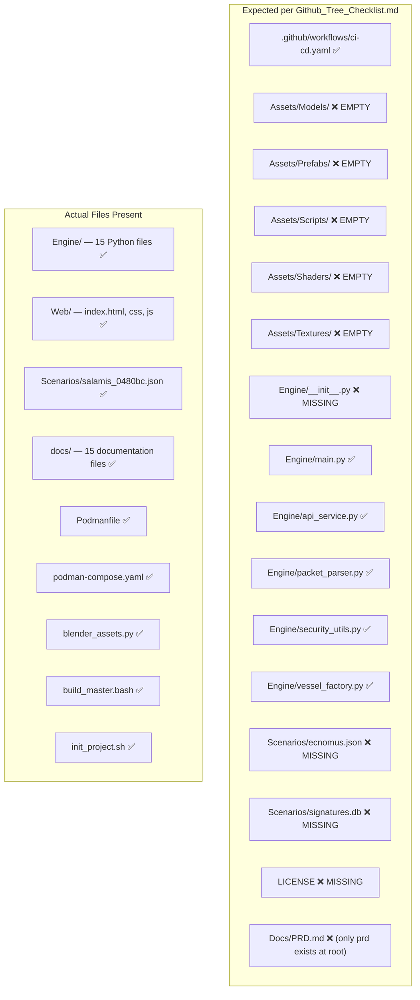
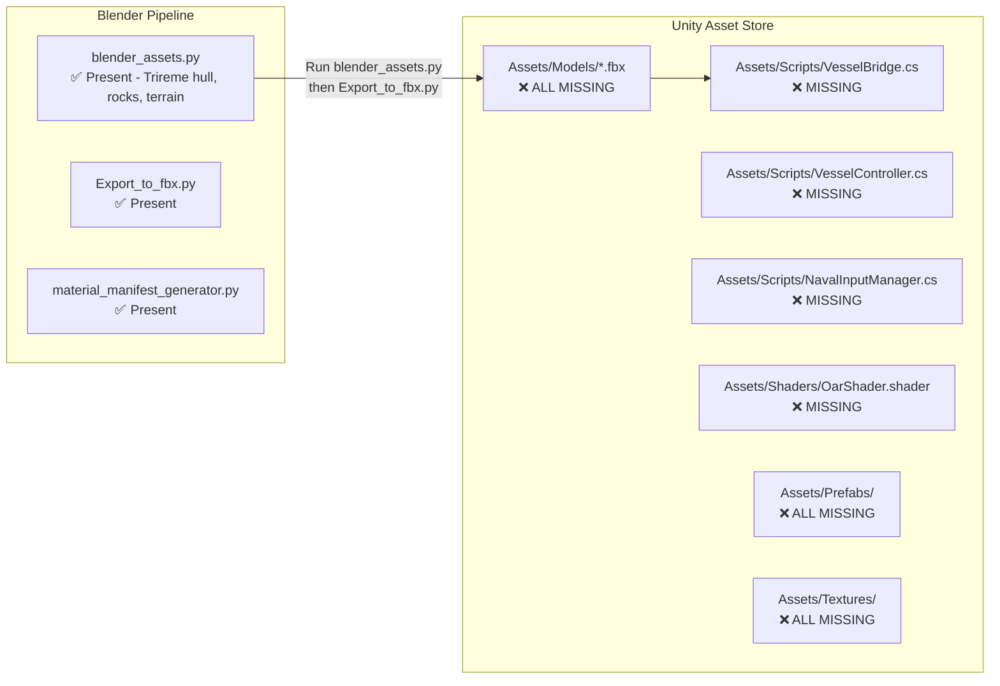
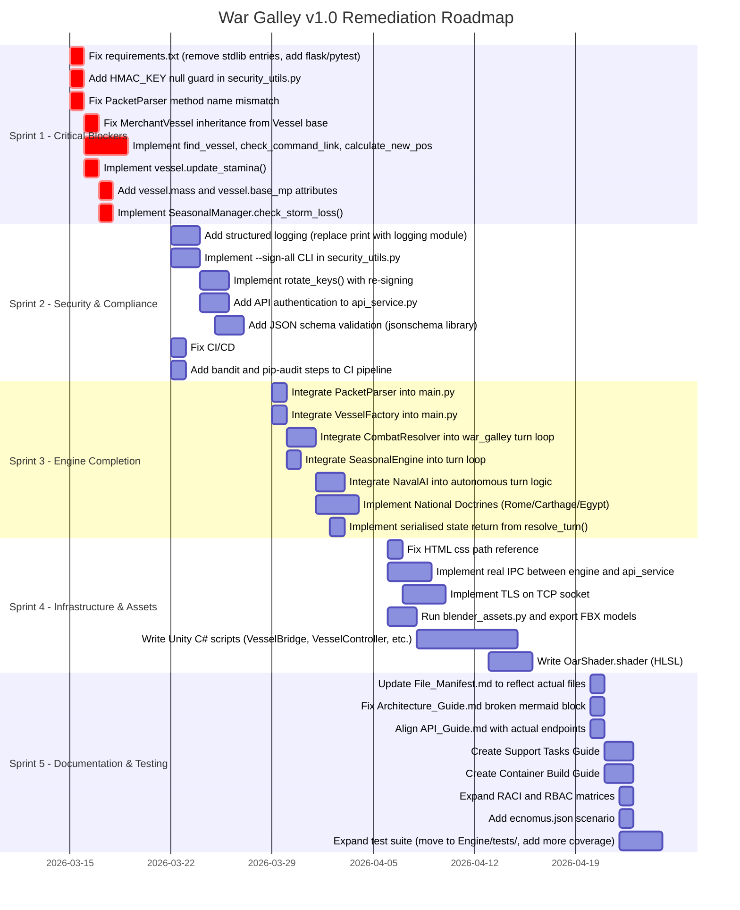
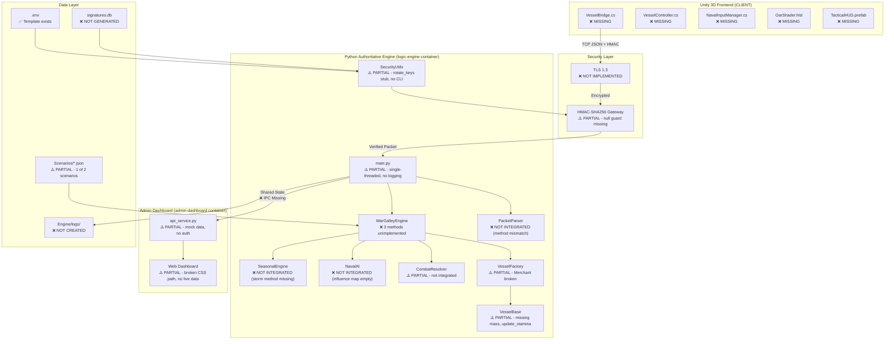

# War Galley v1.0 — Gap Analysis Report

**Document:** `master_oars_gap_analysis.md`
**Project:** Master of Oars / War Galley v1.0
**Date:** 2026-03-14
**Analyst:** Claude (Sonnet 4.6)
**Reference PRD:** `master_of_oars_prd.md`
**Scope:** Full cross-examination of all files in `C:\master_of_oars` against the PRD requirements, compliance standards, and documentation expectations.

---

## Table of Contents

1. [Executive Summary](#1-executive-summary)
2. [Methodology](#2-methodology)
3. [Repository Structure vs PRD Expectations](#3-repository-structure-vs-prd-expectations)
4. [Code Gap Analysis — Python Engine](#4-code-gap-analysis--python-engine)
5. [Code Gap Analysis — Web Dashboard](#5-code-gap-analysis--web-dashboard)
6. [Asset Gap Analysis — Unity / Blender](#6-asset-gap-analysis--unity--blender)
7. [Security & Compliance Gap Analysis](#7-security--compliance-gap-analysis)
8. [Documentation Gap Analysis](#8-documentation-gap-analysis)
9. [CI/CD and DevOps Gap Analysis](#9-cicd-and-devops-gap-analysis)
10. [Scenario Data Gap Analysis](#10-scenario-data-gap-analysis)
11. [Prioritised Gap Register](#11-prioritised-gap-register)
12. [Recommended Remediation Roadmap](#12-recommended-remediation-roadmap)
13. [Architecture Coverage Diagram](#13-architecture-coverage-diagram)
14. [Sources & References](#14-sources--references)

---

## 1. Executive Summary

The War Galley v1.0 project has a well-defined PRD and a partially implemented codebase. The Python authoritative engine skeleton is in place, compliance intent is documented, and Podman containerisation is configured. However, significant gaps exist across **functionality**, **security**, **testing**, **Unity assets**, and **documentation** that must be closed before the project can be considered production-ready.

**Overall Completion Estimate by Domain:**

| Domain | Estimated Completion |
|---|---|
| Python Engine Core | ~35% |
| Security & Compliance | ~40% |
| Unity Frontend | ~5% (C# files entirely absent) |
| Web Admin Dashboard | ~25% |
| Documentation | ~55% |
| Testing & CI/CD | ~20% |
| Scenario Data | ~15% |

> **Critical finding:** The `Assets/Scripts/`, `Assets/Shaders/`, `Assets/Prefabs/`, `Assets/Models/`, and `Assets/Textures/` directories are **completely empty**. All Unity C# code referenced in documentation does not exist in the repository.

---

## 2. Methodology

Each file was individually read and cross-referenced against:

- `master_of_oars_prd.md` — functional and compliance requirements
- `README.md` — expanded requirements and technical stack
- `docs/Github_Tree_Checklist.md` — expected file manifest
- `docs/File_Manifest.md` — documented expected files
- Individual Engine Python files — implementation completeness
- Applicable standards: FIPS 140-2, NIST 800-53, OWASP Top 10, DISA STIG, CIS Benchmark Level 2

---

## 3. Repository Structure vs PRD Expectations

### 3.1 Structure Comparison Diagram



### 3.2 Missing Files from Expected Manifest

| Expected File | Status | Priority |
|---|---|---|
| `Engine/__init__.py` | ❌ Missing | HIGH |
| `Assets/Scripts/VesselBridge.cs` | ❌ Missing | CRITICAL |
| `Assets/Scripts/VesselController.cs` | ❌ Missing | CRITICAL |
| `Assets/Scripts/NavalInputManager.cs` | ❌ Missing | CRITICAL |
| `Assets/Shaders/OarShader.shader` (NavalOars.hlsl) | ❌ Missing | CRITICAL |
| `Assets/Prefabs/` (all prefabs) | ❌ Missing | CRITICAL |
| `Assets/Models/` (all .fbx files) | ❌ Missing | HIGH |
| `Assets/Textures/` (all PBR maps) | ❌ Missing | HIGH |
| `Scenarios/ecnomus.json` | ❌ Missing (referenced in File_Manifest.md) | MEDIUM |
| `Scenarios/signatures.db` | ❌ Missing (generated artefact, but init step broken) | HIGH |
| `LICENSE` | ❌ Missing | MEDIUM |
| `Engine/logs/` directory | ❌ Missing (created by init_project.sh) | HIGH |

---

## 4. Code Gap Analysis — Python Engine

### 4.1 `main.py` — Core Server Loop

| Requirement | Status | Gap Detail |
|---|---|---|
| TCP socket listener on port 5555 | ✅ Present | — |
| HMAC validation before processing | ✅ Present | — |
| INIT_SCENARIO handler | ✅ Present | — |
| PLAYER_ACTION handler | ✅ Present | — |
| Multi-client / concurrent connections | ❌ Missing | Single-threaded `accept()` loop; one client blocks all others. No `threading.Thread` or `asyncio` used. |
| Graceful shutdown / signal handling | ❌ Missing | No `SIGTERM`/`SIGINT` handler; `is_running` flag is never set to `False`. |
| Tick rate throttling (20Hz per README) | ❌ Missing | No time-based loop; server responds reactively only. |
| Structured logging (DISA STIG) | ❌ Missing | Uses bare `print()`; no `logging` module configured with `LOG_PATH`. |
| ENV_MODE bypass for development | ⚠️ Partial | `.env.example` defines `ENV_MODE` but `main.py` never reads or acts on it. |
| PacketParser integration | ❌ Missing | `packet_parser.py` exists but `main.py` does NOT import or use it; raw JSON parsing is duplicated inline. |
| `VesselFactory` integration | ❌ Missing | `main.py` does not call `VesselFactory.load_scenario()`; `self.engine` receives raw dict, not `Vessel` objects. |
| Exception specificity | ⚠️ Weak | Bare `except Exception as e` — too broad; violates defensive coding practice. |

### 4.2 `war_galley.py` — Turn Resolution Engine

| Requirement | Status | Gap Detail |
|---|---|---|
| Signature verification on init | ✅ Present | — |
| `resolve_turn()` method skeleton | ✅ Present | — |
| `find_vessel()` method | ❌ Missing | Called in `resolve_turn()` but **not implemented**; will raise `AttributeError` at runtime. |
| `check_command_link()` method | ❌ Missing | Called in `resolve_turn()` but **not implemented**; will raise `AttributeError` at runtime. |
| `calculate_new_pos()` method | ❌ Missing | Called in `resolve_turn()` but **not implemented**; will raise `AttributeError` at runtime. |
| Crew stamina update | ⚠️ Stub | Calls `vessel.update_stamina()` but `Vessel` class in `vessel_base.py` has no such method. |
| AI takeover for autonomous vessels | ⚠️ Stub | `ai_logic.py` exists but `war_galley.py` never imports or calls it. |
| National doctrine application (Rome/Carthage/Egypt) | ❌ Missing | PRD FR-04 requirement; no doctrine logic anywhere in codebase. |
| Wind/seasonal influence on movement | ❌ Missing | `seasonal_engine.py` exists but is never called in the turn loop. |
| Combat resolver integration | ❌ Missing | `combat_resolver.py` exists but is never imported or called from `war_galley.py`. |
| Return serialised state for Unity | ❌ Missing | `resolve_turn()` returns `None` implicitly; no vessel state serialisation back to client. |

### 4.3 `vessel_base.py` — Vessel Model

| Requirement | Status | Gap Detail |
|---|---|---|
| Core attributes (pos, heading, hull, oars) | ✅ Present | — |
| `to_dict()` serialisation | ✅ Present | — |
| `apply_damage()` handler | ✅ Present | — |
| `get_forward_vector()` | ✅ Present | — |
| `update_stamina()` method | ❌ Missing | Called by `war_galley.py`; not defined in `Vessel` class. |
| `mass` attribute | ❌ Missing | Used in `combat_resolver.resolve_ram()`; not initialised in `__init__`. |
| `base_mp` attribute | ❌ Missing | Modified in `combat_resolver.resolve_oar_rake()`; not initialised. |
| `is_flagship` / command radius role | ❌ Missing | PRD Section 3.1 requires Flagship designation; no attribute exists. |
| Speed validation / capping | ❌ Missing | No upper bound on `current_speed`; ships can reach infinite speed. |

### 4.4 `combat_resolver.py` — Combat Physics

| Requirement | Status | Gap Detail |
|---|---|---|
| `resolve_ram()` logic | ✅ Present (skeleton) | Uses `attacker.mass` which does not exist in `Vessel`; will raise `AttributeError`. |
| `resolve_oar_rake()` logic | ✅ Present (skeleton) | Uses `defender.base_mp` which does not exist; will raise `AttributeError`. |
| Boarding / Corvus mechanic (Rome doctrine) | ❌ Missing | Referenced in PRD FR-04 and User Guide; not implemented. |
| Artillery / Ballista mechanic (Egypt) | ❌ Missing | Referenced in PRD FR-04 and User Guide; not implemented. |
| Carthage MP Boost doctrine | ❌ Missing | Referenced in PRD FR-04; not implemented. |
| `apply_damage()` delegation to vessel | ⚠️ Inconsistent | `combat_resolver.py` directly modifies `hull_integrity` bypassing `vessel.apply_damage()`. |

### 4.5 `vessel_crew.py` — Crew & Stamina

| Requirement | Status | Gap Detail |
|---|---|---|
| `Crew` class with stamina | ✅ Present | — |
| `process_fatigue()` | ✅ Present | — |
| `get_performance_penalty()` | ✅ Present | — |
| Kybernetes specialist effect | ❌ Missing | `specialists["Kybernetes"]` is stored but never applied anywhere in code. |
| Crew quality differentiation | ❌ Missing | `__init__` accepts `quality` parameter but ignores it; no stat variation by quality. |
| Toxotai (archer) combat integration | ❌ Missing | Stored in `vessel_factory.py` as an integer count; no combat method uses it. |

### 4.6 `merchant_vessel.py` — Merchant Class

| Requirement | Status | Gap Detail |
|---|---|---|
| Class definition | ✅ Present | — |
| `calculate_movement()` stub | ✅ Present | — |
| Inherits from `Vessel` base class | ❌ Missing | `MerchantVessel.__init__` takes no arguments and does not call `super().__init__()`. Incompatible with `VesselFactory`. |
| `to_dict()` serialisation | ❌ Missing | Inheriting nothing; merchant vessels cannot be serialised for Unity. |
| Wind-driven movement implementation | ❌ Missing | `calculate_movement()` body is empty (`pass`). |

### 4.7 `security_utils.py` — HMAC/FIPS

| Requirement | Status | Gap Detail |
|---|---|---|
| HMAC-SHA256 generation | ✅ Present | — |
| `verify_scenario()` with `hmac.compare_digest()` | ✅ Present | — |
| `rotate_keys()` method | ⚠️ Stub | Method exists but body is `pass`; key rotation is non-functional. |
| `--sign-all` CLI mode | ❌ Missing | Referenced in README and First_Launch_Checklist; `security_utils.py` has no `if __name__ == "__main__"` block or `argparse` handling. |
| `signatures.db` generation | ❌ Missing | No code in the project creates or reads a `signatures.db` file. |
| Null key guard | ❌ Missing | If `HMAC_KEY` is not set in `.env`, `os.getenv()` returns `None` and `.encode()` will raise `AttributeError`. |
| FIPS 140-3 upgrade path | ❌ Missing | PRD notes FIPS 140-2 minimum; no path to 140-3 (`cryptography` library with FIPS provider not used). |

### 4.8 `packet_parser.py` — TCP Parsing

| Requirement | Status | Gap Detail |
|---|---|---|
| JSON decode and HMAC verify | ✅ Present | — |
| `format_server_update()` for outbound signing | ✅ Present | — |
| Integration into `main.py` | ❌ Missing | `main.py` re-implements parsing inline and never imports `PacketParser`. |
| Constructor signature mismatch | ❌ Bug | `PacketParser.__init__` takes `secret_key` as argument, but `SecurityManager.__init__` reads from `.env`; API is incompatible. |
| `security.verify_signature()` call | ❌ Bug | Calls `self.security.verify_signature()` but `SecurityManager` only has `verify_scenario()`; method name mismatch. |

### 4.9 `api_service.py` — Web Telemetry API

| Requirement | Status | Gap Detail |
|---|---|---|
| Flask app with `/api/v1/telemetry` | ✅ Present | — |
| Real engine state integration | ❌ Missing | Returns hardcoded mock data; no connection to the running `WarGalleyEngine` instance. |
| Shared state mechanism (IPC/DB/queue) | ❌ Missing | No inter-process communication between `logic-engine` and `admin-dashboard` containers. |
| Authentication on API endpoints | ❌ Missing | RBAC doc defines an Analyst role with read-only access; API has zero authentication. |
| HTTPS / TLS for dashboard | ❌ Missing | Architecture doc mentions TLS 1.3; API runs plain HTTP. |
| Content Security Policy headers | ❌ Missing | OWASP requirement; Flask app has no security headers. |
| `requirements.txt` includes Flask | ❌ Missing | `api_service.py` imports `flask` but `Engine/requirements.txt` does not list it. |

### 4.10 `ai_logic.py` — Autonomous AI

| Requirement | Status | Gap Detail |
|---|---|---|
| `NavalAI` class | ✅ Present | — |
| `get_autonomous_action()` basic logic | ✅ Present (minimal) | — |
| `generate_influence_map()` implementation | ❌ Missing | Body is `pass`; influence map is a PRD core mechanic. |
| Integration into `war_galley.py` turn loop | ❌ Missing | Never imported or called. |
| Flagship threat priority logic | ❌ Missing | Comment mentions it; not implemented. |

### 4.11 `seasonal_engine.py` — Environmental Engine

| Requirement | Status | Gap Detail |
|---|---|---|
| `SeasonalManager` class with modifiers | ✅ Present | — |
| `check_storm_loss()` method | ❌ Missing | Called in `apply_season()` but not defined; will raise `AttributeError`. |
| Integration into turn loop | ❌ Missing | Never imported or called. |
| `fleet.strategic_mp` attribute | ❌ Missing | `Vessel` class has no `strategic_mp` attribute; will raise `AttributeError`. |

### 4.12 `requirements.txt` — Dependencies

| Issue | Detail |
|---|---|
| `hashlib` listed | ❌ Error — `hashlib` is a Python standard library module; cannot be pip-installed. Will cause `pip install` failure. |
| `hmac` listed | ❌ Error — `hmac` is also a standard library module; same failure. |
| `flask` missing | ❌ Missing — required by `api_service.py`. |
| `pytest` missing | ❌ Missing — required for CI/CD pipeline tests. |
| `pythonnet==3.0.3` | ⚠️ Review — only needed if interfacing with .NET/Unity from Python directly; not demonstrated in any code. |

---

## 5. Code Gap Analysis — Web Dashboard

| File | Gap | Priority |
|---|---|---|
| `Web/index.html` | Typo: `"Latentcy"` should be `"Latency"` | LOW |
| `Web/index.html` | CSS path is `href="style.css"` but file is at `Web/css/style.css`; broken link | HIGH |
| `Web/js/dashboard.js` | Hardcoded mock Chart.js data (`[12, 2, 3]`) never replaced with live API data | MEDIUM |
| `Web/js/dashboard.js` | No Content Security Policy; `innerHTML`/`innerText` used without sanitisation | MEDIUM |
| `Web/js/dashboard.js` | `setInterval(updateDashboard, 5000)` called but `updateDashboard` is never called on load; dashboard is blank for first 5 seconds | LOW |
| `Web/css/style.css` | Not read/analysed (not linked correctly); no dark mode per UI design spec | MEDIUM |
| `Web/` | No authentication; Admin Console is open to any network client | HIGH |
| `Web/` | No WebSocket support; polling every 5s is inefficient for a 20Hz engine | LOW |

---

## 6. Asset Gap Analysis — Unity / Blender



| Asset | Referenced In | Status |
|---|---|---|
| `VesselBridge.cs` | README, User_Guide, First_Launch_Checklist, Troubleshooting_Guide | ❌ Missing |
| `VesselController.cs` | Performance_Optimization_Guide, Troubleshooting_Guide | ❌ Missing |
| `NavalInputManager.cs` | User_Guide, First_Launch_Checklist | ❌ Missing |
| `OarShader.shader` / `NavalOars.hlsl` | README, Performance_Optimization_Guide, Troubleshooting_Guide | ❌ Missing |
| `TacticalHUD.prefab` | File_Manifest.md | ❌ Missing |
| Trireme `.fbx` model | README, First_Launch_Checklist | ❌ Missing (Blender script exists but not run) |
| PBR Textures (Bronze, Wood, etc.) | README | ❌ Missing |
| `VesselManager.cs` | File_Manifest.md | ❌ Missing |

> **Note:** `blender_assets.py` contains logic to generate geometry but it is a standalone script that must be run manually inside Blender. No CI/CD step automates this. The generated `.fbx` files are not committed.

---

## 7. Security & Compliance Gap Analysis

```mermaid
graph TD
    PRD_SEC["PRD Compliance Requirements"]

    PRD_SEC --> FIPS["FIPS 140-2\nHMAC-SHA256"]
    PRD_SEC --> CIS["CIS Level 2\nRootless Podman"]
    PRD_SEC --> DISA["DISA STIG\nEncrypted Audit Logs"]
    PRD_SEC --> OWASP["OWASP\nSchema Validation"]

    FIPS --> F1["✅ HMAC-SHA256 implemented"]
    FIPS --> F2["❌ Key null-guard missing"]
    FIPS --> F3["❌ --sign-all CLI missing"]
    FIPS --> F4["❌ signatures.db not created"]
    FIPS --> F5["❌ key rotation non-functional"]

    CIS --> C1["✅ Non-root user in Podmanfile"]
    CIS --> C2["✅ --no-install-recommends used"]
    CIS --> C3["❌ No read-only filesystem flag"]
    CIS --> C4["❌ No seccomp profile defined"]
    CIS --> C5["❌ No resource limits (CPU/Memory)"]

    DISA --> D1["❌ Bare print() used, not logging module"]
    DISA --> D2["❌ LOG_PATH env var defined but unused"]
    DISA --> D3["❌ No log rotation configured"]
    DISA --> D4["❌ Audit log encryption not implemented"]

    OWASP --> O1["❌ No JSON Schema validation library used"]
    OWASP --> O2["❌ api_service.py has no authentication"]
    OWASP --> O3["❌ No rate limiting on TCP port 5555"]
    OWASP --> O4["❌ No TLS on TCP socket (Architecture doc says TLS 1.3)"]
    OWASP --> O5["❌ No Content Security Policy headers on web dashboard"]
```



### 7.1 Detailed Security Gaps

| Standard | Gap | Severity | Evidence |
|---|---|---|---|
| FIPS 140-2 | `HMAC_KEY` null guard missing in `security_utils.py` | CRITICAL | `os.getenv("HMAC_KEY").encode()` — `NoneType` crash if key missing |
| FIPS 140-2 | `rotate_keys()` is a stub (`pass`) | HIGH | `security_utils.py` line — body is empty |
| FIPS 140-2 | `--sign-all` CLI not implemented | HIGH | Referenced in README, First_Launch_Checklist; no `argparse` in `security_utils.py` |
| FIPS 140-2 | `signatures.db` never created by any code | HIGH | Referenced in File_Manifest.md and `.gitignore`; no code generates it |
| FIPS 140-2 | `ENV_MODE=DEVELOPMENT` bypass defined in `.env.example` but never honoured in code | MEDIUM | `main.py` does not read `ENV_MODE` |
| DISA STIG | All logging via `print()` — no structured, file-backed audit log | HIGH | `main.py`, `war_galley.py` use `print()` |
| DISA STIG | `LOG_PATH` env var defined but never used | HIGH | `.env.example` defines it; no Python file reads it |
| DISA STIG | No log encryption | MEDIUM | Security_Compliance.md states "Encrypted Audit Logs" |
| CIS Level 2 | No `--read-only` filesystem in Podmanfile | MEDIUM | Podmanfile has no `--read-only` flag |
| CIS Level 2 | No CPU/Memory resource limits in `podman-compose.yaml` | MEDIUM | No `deploy.resources` section |
| CIS Level 2 | No seccomp security profile | MEDIUM | Podmanfile has no `--security-opt seccomp=` |
| OWASP | No JSON schema validation (e.g., `jsonschema` library) | HIGH | `main.py` parses raw JSON with no field validation beyond key access |
| OWASP A07 | No authentication on Admin API (`api_service.py`) | HIGH | `/api/v1/telemetry` is unauthenticated |
| OWASP A02 | TCP socket not encrypted (TLS 1.3 absent) | HIGH | Architecture doc specifies TLS; `socket.socket()` is plaintext |
| OWASP A05 | No security headers on Flask app | MEDIUM | No `X-Content-Type-Options`, `CSP`, `X-Frame-Options` |
| NIST 800-53 | No rate limiting on TCP connections | MEDIUM | `main.py` `socket.listen()` has no connection rate throttle |
| General | `PacketParser.security.verify_signature()` method does not exist | CRITICAL | Method name mismatch — `SecurityManager` has `verify_scenario()` not `verify_signature()` |

---

## 8. Documentation Gap Analysis

| Document | Status | Gaps Found |
|---|---|---|
| `Architecture_Guide.md` | ⚠️ Incomplete | Mermaid diagram cuts off mid-block; no closing ` ``` ` fence. `ECON` node referenced but no economic engine exists in code. TLS layer shown but not implemented. |
| `API_Guide.md` | ⚠️ Incomplete | Only one endpoint documented (`/v1/vessel/update`). The actual implemented endpoint is `/api/v1/telemetry` (GET). Document describes a `POST` endpoint that does not exist in `api_service.py`. |
| `Security_Compliance.md` | ⚠️ Outdated | TLS 1.3 listed as "In Progress" but no implementation exists. Several resolved risks are not actually resolved in code. |
| `RACI_Matrix.md` | ⚠️ Minimal | Only 4 tasks listed. Missing tasks: scenario signing, Unity integration, testing, CI/CD maintenance, key rotation. |
| `RBAC_Matrix.md` | ⚠️ Minimal | No technical enforcement described. No mapping to actual system access controls. |
| `Deployment_Guide.md` | ⚠️ Incomplete | Step 4 says "Execute `Engine/main.py`" directly — contradicts containerised deployment model. Missing HMAC key generation steps. |
| `Maintenance_Guide.md` | ⚠️ Minimal | References `battle_report.csv` which does not exist anywhere in the codebase. |
| `File_Manifest.md` | ❌ Inaccurate | Lists `VesselManager.cs`, `NavalOars.hlsl`, `TacticalHUD.prefab`, `ecnomus.json`, `signatures.db` — none of which exist. |
| `Github_Tree_Checklist.md` | ⚠️ Aspirational | Most items under Unity Frontend are unchecked; `Engine/__init__.py` missing. |
| `User_Guide.md` | ⚠️ Incomplete | References Unity scene objects (`VesselBridge`, `NavalInputManager`) that don't exist. No walkthrough of first game action. |
| `Troubleshooting_Guide.md` | ✅ Good | Well structured; covers known failure modes. References `VesselBridge.cs` HMAC key hardcoding — security concern. |
| `Performance_Optimization_Guide.md` | ✅ Good | Accurate and useful. |
| `Release_Notes.md` | ⚠️ Aspirational | Lists features as shipped that are not implemented (e.g., "Command Radius: Implemented", "Fatigue Mechanics: Added"). |
| `First_Launch_Checklist.md` | ⚠️ Broken | Step "Run `python Engine/security_utils.py --sign-all`" will fail as this CLI flag is not implemented. |
| `master_of_oars_ui_design.md` | ✅ Good | Well specified. Not yet implemented in `Web/` layer. |
| **MISSING: Support Tasks Guide** | ❌ Not present | Referenced in user preferences; no support tasks document exists. |
| **MISSING: Container Build Guide** | ❌ Not present | Separate guide required per preferences; currently folded into Deployment_Guide minimally. |

---

## 9. CI/CD and DevOps Gap Analysis

| Area | Status | Gap Detail |
|---|---|---|
| CI/CD pipeline file | ✅ Present (`.github/workflows/ci-cd.yml`) | — |
| Backend Python tests job | ✅ Defined | Runs `pytest Engine/tests/` — but `Engine/tests/` directory does not exist. `test_war_galley.py` is in `Engine/` root. |
| Container build job | ⚠️ Mixed | Uses `docker build` not `podman build` — inconsistent with project's Podman preference. |
| Trivy vulnerability scan | ✅ Good | Correct; blocks on CRITICAL/HIGH CVEs. |
| Unity build check | ⚠️ Aspirational | Requires `UNITY_LICENSE` secret which is unlikely to be configured. |
| No secrets scanning step | ❌ Missing | No `truffleHog` or `gitleaks` step to detect committed secrets. |
| No SAST (Static Analysis) step | ❌ Missing | No `bandit` (Python SAST) step for NIST/OWASP compliance. |
| No dependency audit step | ❌ Missing | No `pip-audit` or `safety` step for CVE checking of Python deps. |
| `podman compose` not `docker build` | ❌ Inconsistent | CI uses `docker build`; project mandates Podman. |
| Test coverage reporting | ❌ Missing | No `--cov` flag or coverage upload step. |
| `build_master.bash` | ✅ Present | Works correctly; handles both `podman-compose` and `podman compose`. |
| `init_project.sh` | ⚠️ Gap | Creates `Docs/` directory with capital D but actual directory is `docs/` (lowercase). Case-sensitive on Linux containers. |

---

## 10. Scenario Data Gap Analysis

| Item | Status | Gap Detail |
|---|---|---|
| `salamis_0480bc.json` | ✅ Present | One of two vessels is typed `"Phoenician_Trader"` — `VesselFactory` maps this to `MerchantVessel`, but `MerchantVessel` is broken (no `super().__init__()`). |
| `ecnomus.json` | ❌ Missing | Listed in `File_Manifest.md`; does not exist. |
| `signatures.db` | ❌ Missing | Referenced in `.gitignore` and `File_Manifest.md`; no code generates it. |
| Scenario HMAC signing workflow | ❌ Broken | No complete end-to-end signing workflow exists; `--sign-all` CLI missing. |
| Scenario schema validation | ❌ Missing | No JSON schema to validate scenario files before load. |
| Scenario for national doctrines | ❌ Missing | Rome (Corvus), Carthage (MP Boost), Egypt (Artillery) — none have a dedicated test scenario. |

---

## 11. Prioritised Gap Register

```mermaid
quadrantChart
    title Gap Priority Matrix (Impact vs Effort)
    x-axis Low Effort --> High Effort
    y-axis Low Impact --> High Impact
    quadrant-1 Do First
    quadrant-2 Plan Carefully
    quadrant-3 Do Later
    quadrant-4 Quick Wins

    "Fix requirements.txt": [0.15, 0.75]
    "Add HMAC null guard": [0.1, 0.95]
    "Fix PacketParser method name": [0.1, 0.9]
    "Add __init__.py": [0.05, 0.55]
    "Fix css path in index.html": [0.05, 0.45]
    "Add structured logging": [0.25, 0.85]
    "Implement find_vessel()": [0.2, 0.95]
    "Implement check_command_link()": [0.25, 0.9]
    "Implement calculate_new_pos()": [0.3, 0.9]
    "Fix MerchantVessel inheritance": [0.15, 0.7]
    "Implement --sign-all CLI": [0.3, 0.8]
    "Implement rotate_keys()": [0.3, 0.75]
    "Add Flask to requirements": [0.05, 0.8]
    "Add vessel mass & base_mp": [0.15, 0.8]
    "Write Unity C# scripts": [0.9, 1.0]
    "Implement TLS on socket": [0.7, 0.85]
    "Implement national doctrines": [0.75, 0.7]
    "Implement influence map AI": [0.8, 0.6]
    "Real telemetry IPC": [0.7, 0.75]
    "Add API authentication": [0.4, 0.85]
    "Add bandit/pip-audit to CI": [0.2, 0.7]
    "Fix CI docker vs podman": [0.1, 0.6]
```

### 11.1 Critical Blockers (Will Crash at Runtime)

| ID | Gap | File | Impact |
|---|---|---|---|
| BLK-01 | `war_galley.find_vessel()` not implemented | `war_galley.py` | Engine crashes on first PLAYER_ACTION |
| BLK-02 | `war_galley.check_command_link()` not implemented | `war_galley.py` | Engine crashes on first PLAYER_ACTION |
| BLK-03 | `war_galley.calculate_new_pos()` not implemented | `war_galley.py` | Engine crashes on first PLAYER_ACTION |
| BLK-04 | `vessel.update_stamina()` not implemented | `vessel_base.py` | Engine crashes on first PLAYER_ACTION |
| BLK-05 | `PacketParser.security.verify_signature()` does not exist | `packet_parser.py` | Packet validation crashes |
| BLK-06 | `vessel.mass` attribute missing | `vessel_base.py` | Combat resolver crashes on ram |
| BLK-07 | `vessel.base_mp` attribute missing | `vessel_base.py` | Oar rake crashes on combat |
| BLK-08 | `SeasonalManager.check_storm_loss()` not implemented | `seasonal_engine.py` | Seasonal engine crashes |
| BLK-09 | `MerchantVessel.__init__` incompatible with `VesselFactory` | `merchant_vessel.py` | Factory crashes on Merchant creation |
| BLK-10 | `HMAC_KEY` null guard missing | `security_utils.py` | Server crashes if `.env` incomplete |
| BLK-11 | `hashlib` and `hmac` in `requirements.txt` are stdlib | `requirements.txt` | `pip install` fails in container build |

---

## 12. Recommended Remediation Roadmap



---

## 13. Architecture Coverage Diagram

The diagram below shows which components are implemented (green), partially implemented (amber), and missing (red).



---

## 14. Sources & References

| Source | Purpose |
|---|---|
| `C:\master_of_oars\master_of_oars_prd.md` | Primary requirements baseline |
| `C:\master_of_oars\README.md` | Extended requirements and technical stack |
| `C:\master_of_oars\docs\Github_Tree_Checklist.md` | Expected file manifest |
| `C:\master_of_oars\docs\File_Manifest.md` | Documented expected file list |
| All files in `C:\master_of_oars\Engine\` | Python engine implementation analysis |
| All files in `C:\master_of_oars\docs\` | Documentation completeness analysis |
| `C:\master_of_oars\Web\` | Dashboard implementation analysis |
| `C:\master_of_oars\.github\workflows\ci-cd.yml` | CI/CD pipeline analysis |
| `C:\master_of_oars\podman-compose.yaml` | Container orchestration analysis |
| `C:\master_of_oars\podmanfile` | Container hardening analysis |
| NIST SP 800-53 Rev 5 — https://csrc.nist.gov/publications/detail/sp/800-53/rev-5/final | Audit/logging requirements |
| FIPS 140-2 — https://csrc.nist.gov/publications/detail/fips/140/2/final | Cryptographic module standards |
| OWASP Top 10 2021 — https://owasp.org/Top10/ | Web/API security validation |
| CIS Docker Benchmark v1.6 (applicable to Podman) — https://www.cisecurity.org/benchmark/docker | Container hardening guidance |
| DISA STIG for Application Security — https://public.cyber.mil/stigs/ | Audit logging and STIG compliance |
| Python `hmac` stdlib — https://docs.python.org/3/library/hmac.html | Confirming `hmac` is stdlib (not pip-installable) |
| Python `hashlib` stdlib — https://docs.python.org/3/library/hashlib.html | Confirming `hashlib` is stdlib (not pip-installable) |
| GMT Games War Galley Rules — https://www.gmtgames.com/living_rules/WG%20rules-2006.pdf | Game rules baseline (referenced in PRD) |

---

*Document generated: 2026-03-14 | Analyst: Claude Sonnet 4.6 | Version: 1.0*
